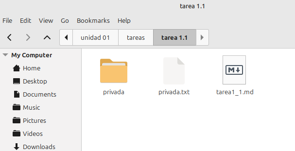
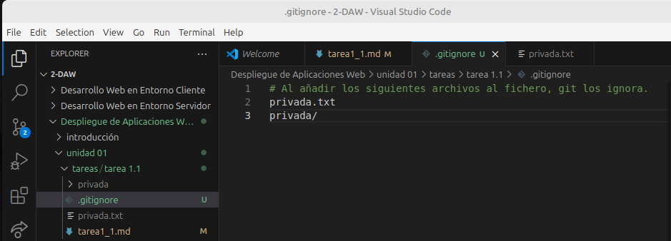

# Trabajando con Git y MarkDown I

## Contenidos

- [Comandos utilizados](#comandos-utilizados)
- [Uso del .gitignore](#uso-del-gitignore)
- [Tabla de perfiles de compañeros](#tabla-con-perfiles-de-compañeros)

### Comandos utilizados
Yo ya tenia creado el repositorio de ante mano, asi que no tuve que crear uno nuevo. Los unicos comandos que he utilizado hasta ahora han sido los siguientes:

1. Creación del repositorio remoto
```
git clone https://github.com/Chugani05/2-DAW.git
```

2. Creación de carpetas:
```
mkdir tareas
mkdir tarea 1.1
```

3. Creación de README:
```
touch tarea_1.md
```

4. Commit inicial:
```
git add .
git commit -m "commit inicial"
git push
```

5. Creación del tag:
```
git tag v0.1
```

### Uso del .gitignore
<div align=center>
    <h3>Directorio con los archivos por ocultar</h3>
    
    <h3>Contenido del fichero .gitignore</h3>
    
</div>


### Tabla con perfiles de compañeros
|Nombre|GitHub|
|------|------|
|Joseph Vanegas|[JVC0](https://github.com/JVC0)|
|Marina Giacomaniello|[mdiogc](https://github.com/mdiogc)|
|Jesus Lugo|[JesusLugo2002](https://github.com/JesusLugo2002)|