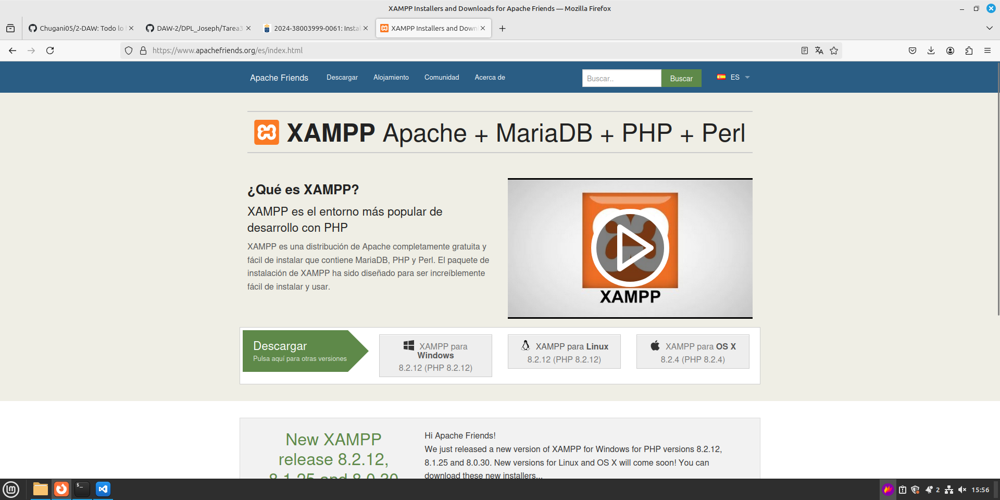
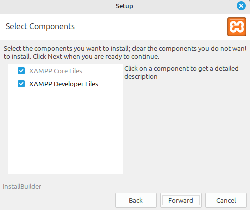
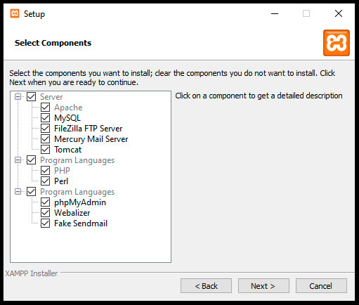
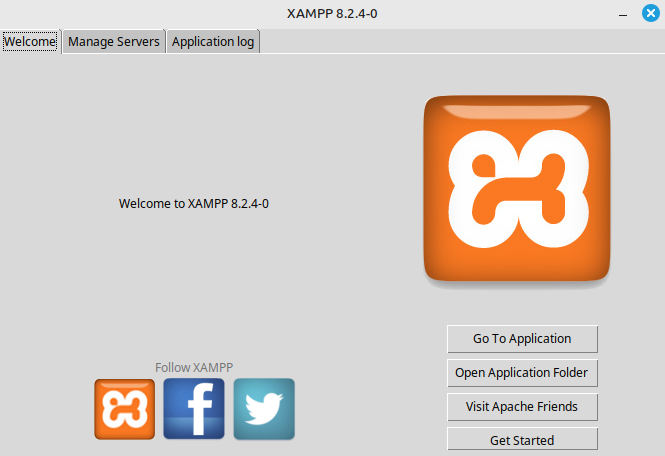
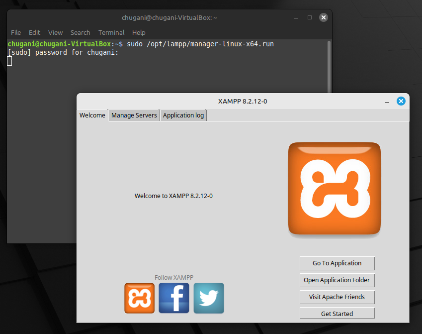
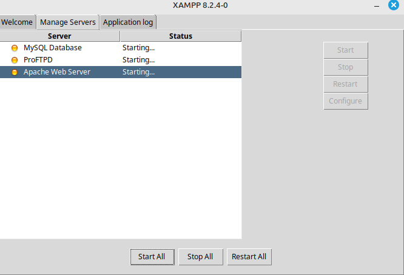

# Instalación de Xampp

### Se descarga la version de Xampp correspondiente para nuestro dispositivo, en mi caso Linux.
<div align=center>
    
</div>

### A continuación cambiamos los permisos del archivo para que este funcione con el siguiente comando:
```bash
sudo chmod +x xampp-linux-*-installer.run
```

### Tras esto se ejecuta el instalador, en este hay que pulsar el boton `Forwrd` o `Next` hasta que se termine la instalación.
<div align=center>
    
</div>
<div align=center>
    
</div>
<div align=center>
    
</div>

### Utilizando el siguiente comando abrimos el panel de control de xampp.
```bash
sudo /opt/lampp/manager-linux-x64.run
```
<div align=center>
    
</div>

### Para comprobar que Xampp está funcionando correctamente nos fijamos en los servidores y los ponemos en marcha.
<div align=center>
    
</div>

### En conclusión, Xampp está funcionando bien, por eso se inicializand eforma rapida.
<div align=center>
    
</div>