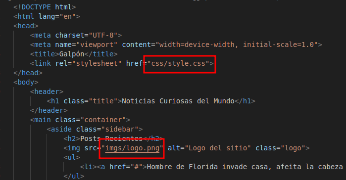
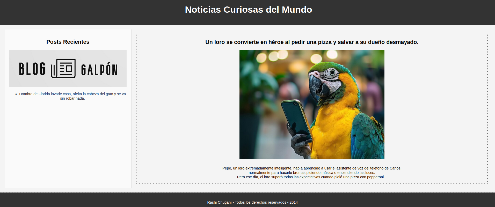

# Trabajando con Git y Markdown III
<div align=center>
    
</div>

## Contenidos
- [Comandos utilizados](#comandos-utilizados)
- [Imágen de web](#imágen-de-web)

## Comandos utilizados
### Creo un directorio de trabajo llamado /bloggalpon/ en el directorio del usuario.
```sh
mkdir bloggalpon
```

### Inicializar el repositorio vacío.
```sh
cd bloggalpon/ && git init
```

### Crear el archivo index.html
```sh
touch index.html
```

### Añadir la estructura básica de una web.
```html
<!DOCTYPE html>
<html lang="en">
<head>

</head>
<body>
    
</body>
</html>
```

### Crear un commit indicando que se crea el esqueleto básico del index.html
```sh
git add . && git commit -m "Se crea el esqueleto básico del index.html"
```

### Añadir el contenido al head, entre `<head>` y `</head>`.
```html
<head>
    <meta charset="UTF-8">
    <meta name="viewport" content="width=device-width, initial-scale=1.0">
    <title>Blog Galpón</title>
</head>
```

### Crear un commit indicando que se añade la cabecera del index.html

```sh
git add . && git commit -m "Se añade cabecera al index.html"
```

### Añadir el contenido al body, entre `<body>` y `</body>`
```html
<body>
    <header>
        <h1 class="title">Noticias Curiosas del Mundo</h1>
    </header>
    <main class="container">
        <h2>Posts Recientes</h2>
        
    </main>
</body>
```

### Crear un commit indicando que se añade la estructura básica del body.
```sh
git add . && git commit -m "Se añade body al index.html"
```

### Añadir el contenido de section, entre `<section>` y `</section>`
```html
<body>
    <header>
        <h1 class="title">Noticias Curiosas del Mundo</h1>
    </header>
    <main class="container">
        <h2>Posts Recientes</h2>
        
        <section class="content">
                <h2>Un loro se convierte en héroe al pedir una pizza y salvar a su dueño desmayado.</h2>
                
                <p>Pepe, un loro extremadamente inteligente, había aprendido a usar el asistente de voz del teléfono de Carlos, <br> normalmente para hacerle bromas pidiendo música o encendiendo las luces. <br> Pero ese día, el loro superó todas las expectativas cuando pidió una pizza con pepperoni...</p>
        </section>
    </main>
</body>
```

### Crear un commit indicando que se añade toda la estructura de la zona de posts.
```sh
git add . && git commit -m "Se añade estructura de la zona de posts"
```

### Crear un archivo style.css.
```sh
mkdir css && touch css/style.css
``` 

### Añadir la siguiente información.
```css
body {
    font-family: 'Arial', sans-serif;
    margin: 0;
    padding: 0;
    background-color: #f4f4f4;
}
```
### Crear un commit indicando que se añaden las CSS de html y de body.
```sh
git add . && git commit -m "Se añade css al body"
```

### Añadir la siguiente información.   
```css
header {
    background-color: #333;
    color: #fff;
    text-align: center;
    padding: 1rem;
}

.title {
    font-size: 2.5rem;
}

.container {
    display: flex;
    margin: 20px;
}

.sidebar {
    width: 25%;
    background-color: #fafafa;
    padding: 20px;
    border-right: 2px solid #e0e0e0;
}

.sidebar h2 {
    text-align: center;
    font-size: 1.5rem;
}

.logo {
    display: block;
    margin: 0 auto 20px;
    max-width: 100%;
}

.content {
    width: 75%;
    padding: 20px;
}

.post img {
    max-width: 80%;
    height: auto;
    margin-bottom: 10px;
}

footer {
    background-color: #333;
    color: #fff;
    text-align: center;
    padding: 1rem;
    position: relative;
    width: 100%;
    bottom: 0;
}
```

### Crear un commit indicando que se añaden las CSS de varios elementos HTML5: header, section, article, aside y footer.
```sh
git add . && git commit -m "Se añade css a elementos semánticos"
```

### Añadir en el directorio raíz de proyecto el logotipo que aparecerá en la barra lateral izquierda: logo.png

<div align=center>
    
</div>

### Crear un commit indicando que se añade el logotipo de Galpón.
```sh
git add . && git commit -m "Se añade logotipo de Galpón"
```

### Añadir la siguiente información.
```css
.container {
    display: flex;
    margin: 20px;
    text-align: center; /* Novedad */
}
```
### Crear un commit indicando que se añaden las CSS de section.
```sh
git add . && git commit -m "Se añade css a section"
```

### Añadir la siguiente información.
```css
footer {
    background-color: #333;
    color: #fff;
    text-align: center;
    padding: 1rem;
    position: relative;
    width: 100%;
    bottom: 0;
    font-weight: bold; /* Novedad */
}
```

### Crear un commit indicando que se añaden las CSS del footer.
```sh
git add . && git commit -m "Se añade css al footer"
```

### Añadir la siguiente información.
```css
h1 {
    font-weight: bold;
}

a {
    text-decoration: none;
    color: #333;
}

a:hover {
    color: rgb(28, 164, 209);
}
```

### Crear un commit indicando que se añaden las CSS del H1 y de los enlaces.
```sh
git add . && git commit -m "Se añade css al H1 y los enlaces"
```

### Crear una etiqueta de v1.0
```sh
git tag -a v1.0
```

### Crear una rama “desarrollo”. En esta rama de desarrollo vamos a realizar varias tareas:
```sh
git branch desarrollo && git checkout desarrollo
```

### Crear un directorio de images y mover allí el logotipo logo.png.
```sh
mkdir imgs
mv logo.png imgs/
```

### Crear un commit indicando que se mueve el logotipo a la carpeta images.
```sh
git add . && git commit -m "Se mueve logotipo a la carpeta images"
```

### Crear un directorio de CSS y mover allí las CSS style.css.
```sh
mkdir css
mv style.css css/
```

### Crear un commit indicando que se mueve la CSS a la carpeta CSS.
```sh
git add . && git commit -m "Se mueve style.css a su carpeta correspondiente"
```

### Cambiar las referencias a la CSS en el index.htm y al logotipo logo.png en la CSS.

<div align=center>
    
</div>

### Crear un commit indicando que se cambian las referencias a las CSS y a las imágenes al reorganizarlas en directorios.
```sh
git add . && git commit -m "Se cambian las referencias a style.css y logo.png"
```

### Crear una rama “bugfix” a partir de la “master” para resolver una serie de fallos.
```sh
git checkout master
git checkout -b bugfix master
```

### Crear un commit indicando que introducen los punteados en la barra derecha y en el footer.
```css
article {
    border: 1px dashed black; /* Novedad */
}

footer {
    background-color: #333;
    color: #fff;
    text-align: center;
    padding: 1rem;
    position: relative;
    width: 100%;
    bottom: 0;
    font-weight: bold;
    border: 1px dashed black; /* Novedad */
}
```

### Introducir como título “Galpon”.
```html
<head>
    <meta charset="UTF-8">
    <meta name="viewport" content="width=device-width, initial-scale=1.0">
    <title>Galpón</title> <!-- Novedad -->
    <link rel="stylesheet" href="css/style.css">
</head>
```

### Crear un commit indicando que se introduce el título en la página.
```sh
git add . && git commit -m "Se introduce título en la página"
```

### Cambiar 2024 por 2014 en el footer. Quitar @.
```html
<!-- Antes -->
<footer>
    Rashi Chugani @ Todos los derechos reservados - 2024
</footer>

<!-- Después -->
<footer>
    Rashi Chugani - Todos los derechos reservados - 2014
</footer>
```

### Crear un commit indicando que se realizan pequeños ajustes en el footer.
```sh
git add . && git commit -m "Se realizan pequeños ajustes en el footer"
```

### Crear una etiqueta de v1.1
```sh
git tag -a v1.1 -m "Versión 1.1"
```

### Llevar estos cambios a la rama “master”.
```sh
git checkout master
git merge bugfix
```

### Borrar la rama “bugfix”.
```sh
git branch -d bugfix
```

### Llevar los cambios de la rama “desarrollo” a la rama “master”. Resolver los conflictos, si existen.
```sh
git merge desarrollo

# Auto-fusionando css/style.css
# CONFLICTO (contenido): Conflicto de fusión en css/style.css
# Auto-fusionando index.html
# Fusión automática falló; arregle los conflictos y luego realice un commit con el resultado.

git add . && git commit -m "Se resuelven conflictos"
```

### Crear una etiqueta de v1.2
```sh
git tag -a v1.2 -m "Versión 1.2"
```

## Imágen de web
<div align=center>
    
</div>