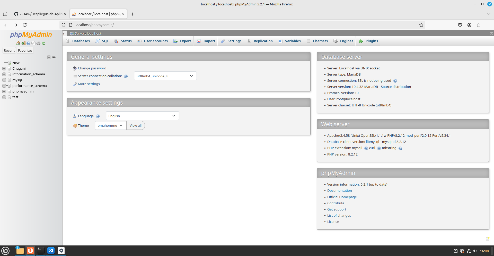
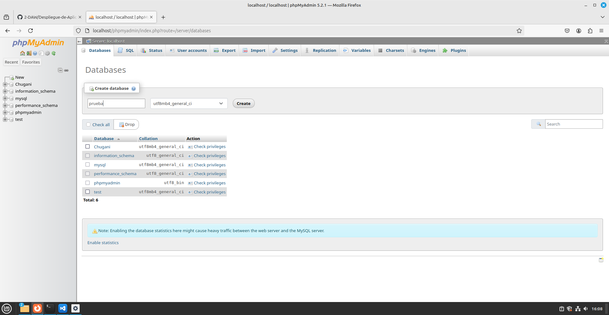
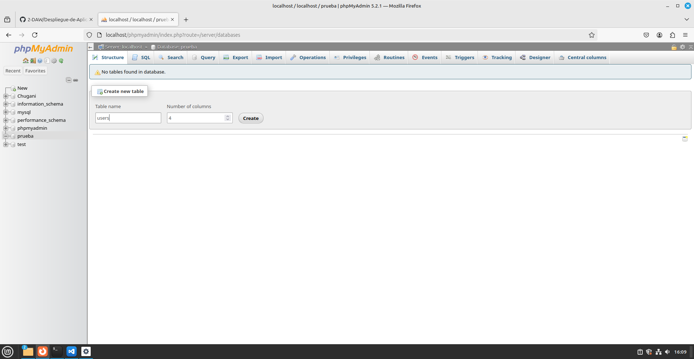
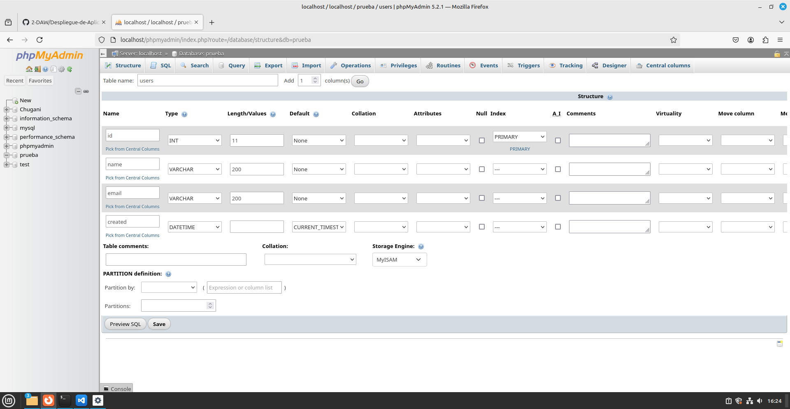
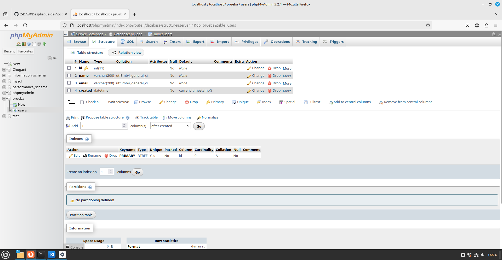
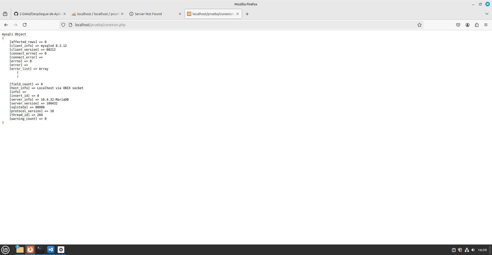

# Conexión a MySQL desde PHP.
<div align=center>

</div>

## Contenido
- [Creación de la conexión.](#creación-de-la-conexión)
- [Creación de la base de datos.](#creación-de-la-base-de-datos)

## Creación de la conexión.
### Creamos la conexión a la base de datos, en este caso a una base de datos que llamaremos `prueba`.
```php
<?php

    $conn = mysqli_connect( 'localhost', 'nombreUsuario', 'contraseñaUsuario', 'prueba');

    echo "<pre>";
    print_r( $conn);

?>
```
## Creación de la base de datos.
<div align=center>
    
</div>
<div align=center>
    
</div>
<div align=center>
    
</div>
<div align=center>
    
</div>
<div align=center>
    
</div>
<div align=center>
    
</div>