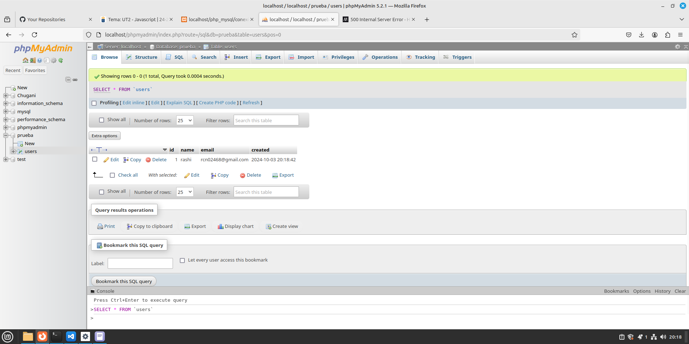

# Registros en la base de datos.
<div align=center>

</div>

## Contenido
- [Inserción de datos en la base de datos.](#inserción-de-datos-en-la-base-de-datos)

## Inserción de registros en la base de datos.
### Cambiamos y añadimos contenido al documento de conexión.
```php
<?php

    echo "<pre>";

    $conn = mysqli_connect( 'localhost', 'nombreUsuario', 'contraseñaUsuario', 'prueba');

    // sentencia sql para incertar datos en la base de datos
    $insert = "insert into users( name, email) values( 'rashi', 'rcn02468@gmail.com')";

    // ejecuta una consulta en la base de datos
    $return = mysqli_query ( $conn, $insert);

    // muestra el valor de la sentencia por pantalla
    print_r( ( $return));

    // cerramos la conecion al servidor
    mysqli_close( $conn)

?>
```

### Comprobamos que los datos hayan sido insertado en `phpMyAdmin`.
<div align=center>
    
</div>

## Leer registros de la base de datos

## Borrar y actualizar la base de datos