# Conexión a MySQL.
<div align=center>

</div>

## Contenido
- [Creación de base de datos y tabla.](#creación-de-base-de-datos-y-tabla)
- [Estructura y funcionamiento](#estructura-y-funcionamiento)
    - [index.php](#indexphp)
    - [sql_get.php](#sql_getphp)
    - [sql_post.php](#sql_postphp)
    - [script.js](#scriptjs)
    - [style.css](#stylecss)
- [Inserción de registros](#inserción-de-registros)
- [Actualización de registros.](#actualización-de-registros)
- [Eliminación de registros.](#eliminación-de-registros)

## Creación de base de datos y tabla.
Creamos la base de datos, en este caso llamada `tarea06` y la tabla `users`.
<div align=center>
    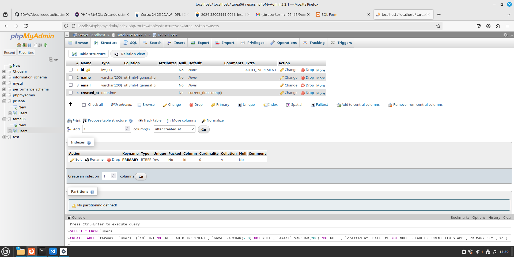
</div>

## Estructura y funcionamiento
### index.php

```php
<!DOCTYPE html>
<html lang="en">
<head>
    <meta charset="UTF-8">
    <meta name="viewport" content="width=device-width, initial-scale=1.0">
    <title>SQL Form</title>
    <link rel="stylesheet" href="css/style.css">
</head>
<body>
    <main>
        <div>
            <h1 id="form-title">SQL Operations Form</h1>
            <label for="sql-query-type">Which operation would you like to perform?:</label>
            <select name="sql-query-type" id="sql-query-type">
                <option value="insert">Insert record</option>
                <option value="update">Update record</option>
                <option value="delete">Delete record</option>
            </select>
            <div id="form-container">
                <form action="sql_post.php" method="post" id="insert-form">
                    <input type="hidden" name="insert">
                    <label for="name">Name: </label><input type="text" name="name" value="" required><br>
                    <label for="email">Email: </label><input type="email" name="email" value="" required><br>
                    <input type="submit" value="Enviar">
                </form>
                <form action="sql_post.php" method="post" id="update-form">
                    <input type="hidden" name="update">
                    <label for="uid">Record ID:  </label><input type="number" name="uid" min="0" value="" required><br>
                    <label for="name">Updated name: </label><input type="text" name="name" value=""><br>
                    <label for="email">Updated email: </label><input type="email" name="email" value=""><br>
                    <input type="submit" value="Enviar">
                </form>
                <form action="sql_post.php" method="post" id="delete-form">
                    <input type="hidden" name="delete">
                    <label for="uid">Record ID:  </label><input type="number" name="uid" min="0" value="" required><br>
                    <input type="submit" value="Enviar">
                </form>
            </div>
        </div>
        <div id="table-container">
            <h1>Resulting Table</h1>
            <table id="result-table">
                <tr>
                    <th>ID</th>
                    <th>Name</th>
                    <th>Email</th>
                    <th>User creation date</th>
                </tr>
            </table>
        </div>
    </main>
   <script type="module" src="js/script.js" type="text/javascript"></script>
</body>
</html>
```

### sql_get.php
```php
<?php

$conn = mysqli_connect('localhost', 'nombreUsuario', 'contraseñaUsuario', 'tarea06');

$query = "select * from users";
$result = mysqli_query($conn, $query);
$rows = mysqli_fetch_all($result, MYSQLI_ASSOC);
print json_encode($rows);

mysqli_close($conn);

?>
```

### sql_post.php
```php
<?php

$conn = mysqli_connect("localhost", "nombreUsuario", "contraseñaUsuario", "tarea06");

$queryType = key($_POST);
$query = "";

switch ($queryType) {
    case "insert":
        $name = mysqli_real_escape_string($conn, $_POST["name"]);
        $email = mysqli_real_escape_string($conn, $_POST["email"]);
        $query = "INSERT INTO users(name, email) VALUES('$name', '$email')";
        break;
    case "update":
        $name = mysqli_real_escape_string($conn, $_POST["name"]);
        $email = mysqli_real_escape_string($conn, $_POST["email"]);
        $id = mysqli_real_escape_string($conn, $_POST["uid"]);
        $query = "UPDATE users SET name = '$name', email = '$email' WHERE id = $id";
        break;
    case "delete":
        $id = mysqli_real_escape_string($conn, $_POST["uid"]);
        $query = "DELETE FROM users WHERE id = $id";
        break;
    default:
        die("Invalid query type");
}

$result = mysqli_query($conn, $query);
mysqli_close($conn);

header("refresh: 3; url=index.php");
echo "Updating data...";
```

### script.js
```js
// Inicialización y consulta de la tabla
const selectResult = await fetchData();

async function fetchData() {
    const response = await fetch("sql_get.php");
    const data = await response.json();
    return data
}

for (let userData of selectResult) {
    createRow(userData);
}

function createRow(data) {
    document.getElementById("result-table").innerHTML += `
    <tr>
        <td>${data.id}</td>
        <td>${data.name}</td>
        <td>${data.email}</td>
        <td>${data.created_at}</td>
    </tr>
    `;
}

// Cambio de operaciones SQL
const sqlQueryTypeSelector = document.getElementById("sql-query-type")
sqlQueryTypeSelector.addEventListener('change', () => {
    console.log
    let queryType = sqlQueryTypeSelector.value
    changeForm(queryType);
})

function changeForm(queryType) {
    switch (queryType) {
        case "insert":
            setInsertForm();
            break;
        case "update":
            setUpdateForm();
            break;
        case "delete":
            setDeleteForm();
            break;
    }
} 

let insertForm = document.getElementById("insert-form");
let updateForm = document.getElementById("update-form");
let deleteForm = document.getElementById("delete-form");

// Operación SQL: Insert
function setInsertForm() {
    insertForm.style.display = "block";
    updateForm.style.display = "none";
    deleteForm.style.display = "none";
}

// Operación SQL: Update
function setUpdateForm() {
    insertForm.style.display = "none";
    updateForm.style.display = "block";
    deleteForm.style.display = "none";
}

// Operación SQL: Delete
function setDeleteForm() {
    insertForm.style.display = "none";
    updateForm.style.display = "none";
    deleteForm.style.display = "block";
}
```

### style.css
```css
/* Global Reset and Base Styles */
body {
    margin: 0;
    font-family: Arial, sans-serif;
    background-color: #f5f5f5;
    color: #333;
    line-height: 1.6;
}

/* Main Layout */
main {
    min-height: 100vh;
    display: flex;
    justify-content: center;
    align-items: center;
    gap: 50px;
    padding: 20px;
    box-sizing: border-box;
    background-color: #fafafa;
}

/* Centered Div Elements */
main div {
    text-align: center;
}

/* Form Container */
#form-container {
    border: 2px solid #ccc;
    border-radius: 8px;
    padding: 20px;
    background-color: #fff;
    box-shadow: 0 4px 8px rgba(0, 0, 0, 0.1);
    max-width: 400px;
    width: 100%;
    text-align: left;
}

#form-container label {
    display: block;
    margin-bottom: 8px;
    font-weight: bold;
}

#form-container input,
#form-container select {
    width: 100%;
    padding: 8px;
    margin-bottom: 15px;
    border: 1px solid #ddd;
    border-radius: 4px;
    box-sizing: border-box;
}

#form-container input[type="submit"] {
    background-color: #4CAF50;
    color: white;
    cursor: pointer;
    border: none;
    padding: 10px 20px;
    border-radius: 4px;
}

#form-container input[type="submit"]:hover {
    background-color: #45a049;
}

/* Result Table Styling */
#table-container {
    max-width: 600px;
    width: 100%;
    background-color: #fff;
    border-radius: 8px;
    padding: 20px;
    box-shadow: 0 4px 8px rgba(0, 0, 0, 0.1);
}

#result-table {
    width: 100%;
    border-collapse: collapse;
    margin-top: 20px;
}

#result-table th, #result-table td {
    padding: 12px;
    border: 1px solid #ddd;
    text-align: left;
}

#result-table th {
    background-color: #f4f4f4;
    font-weight: bold;
}

/* Form Visibility */
#update-form, #delete-form, #insert-form {
    display: none;
}

/* Responsive Design */
@media (max-width: 768px) {
    main {
        flex-direction: column;
        gap: 20px;
    }

    #form-container, #table-container {
        max-width: 100%;
        width: 90%;
    }
}
```

A continuación vemos el resultado de la unión de todos los archivos vistos anteriormente.
<div align=center>
    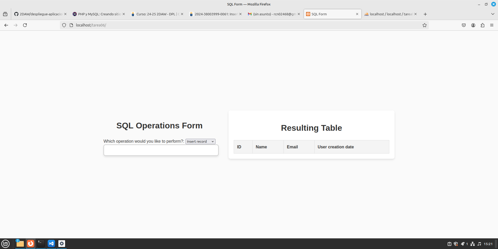
</div>

## Inserción de registros
<div align=center>
    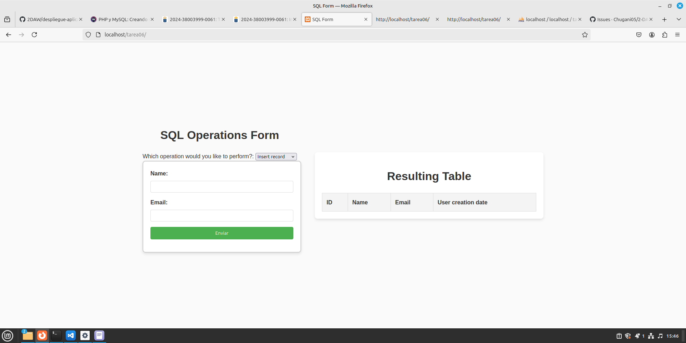
</div>

<div align=center>
    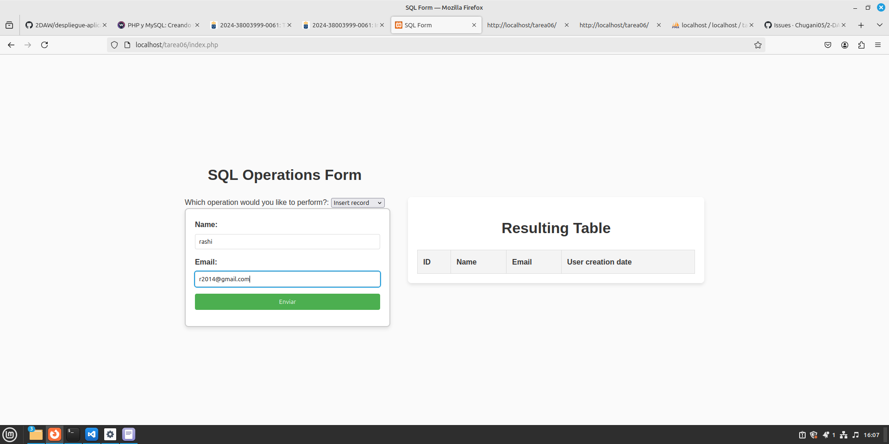
</div>

<div align=center>
    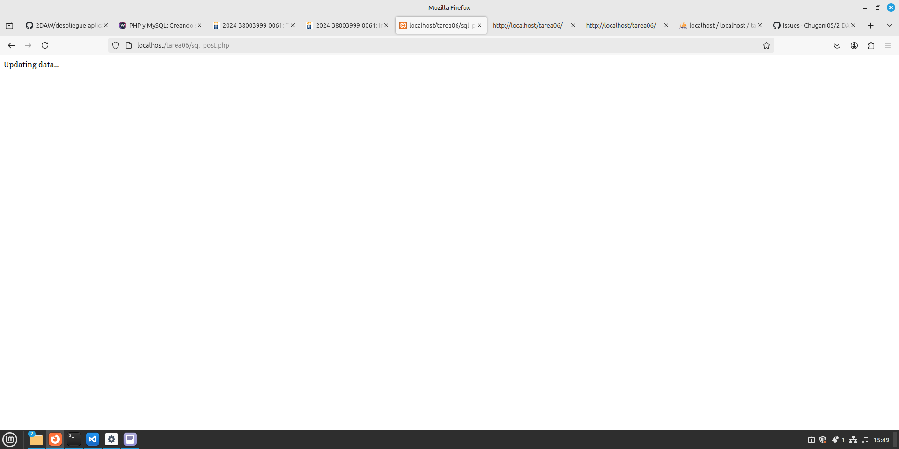
</div>

<div align=center>
    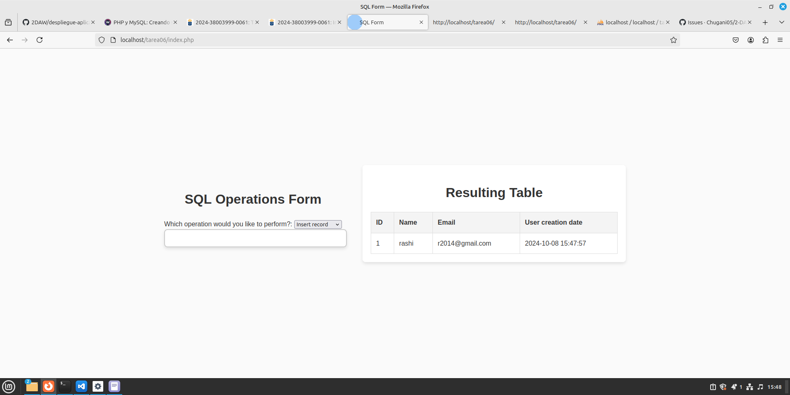
</div>

## Actualización de registros.
<div align=center>
    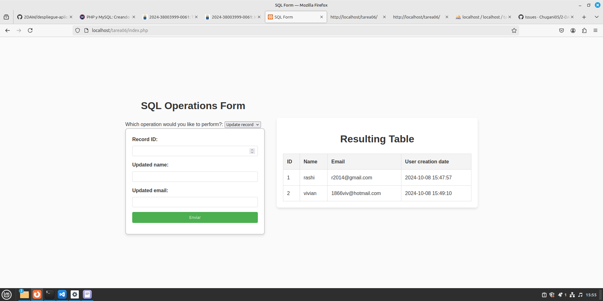
</div>

<div align=center>
    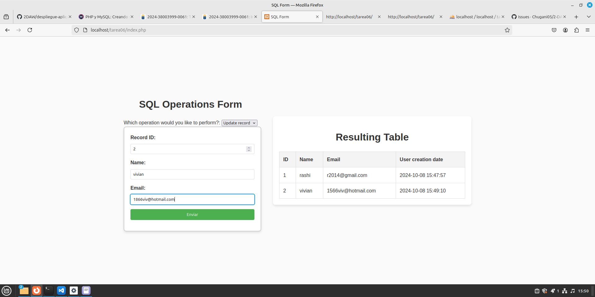
</div>

<div align=center>
    
</div>

<div align=center>
    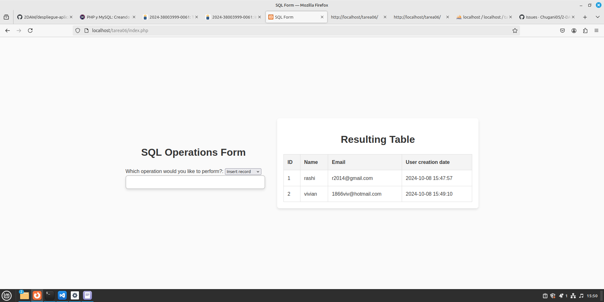
</div>

## Eliminación de registros.
<div align=center>
    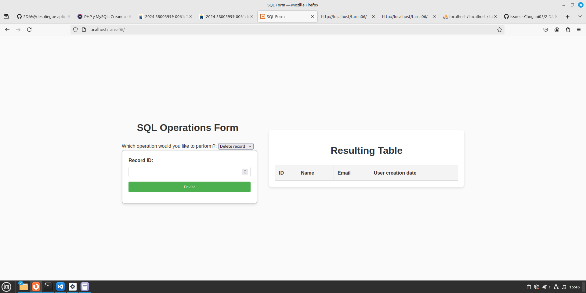
</div>

<div align=center>
    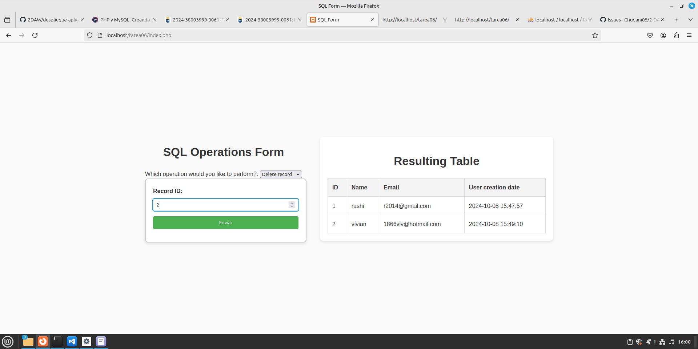
</div>

<div align=center>
    
</div>

<div align=center>
    
</div>
