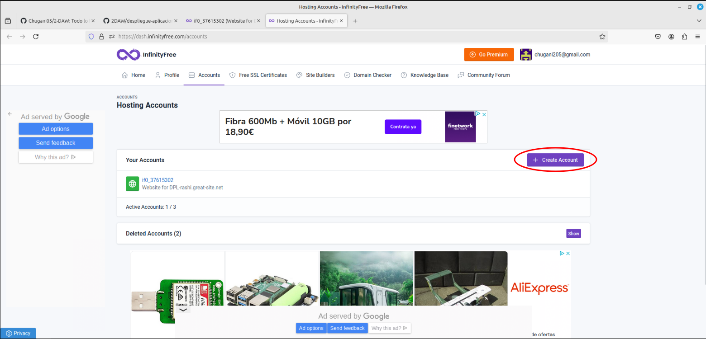
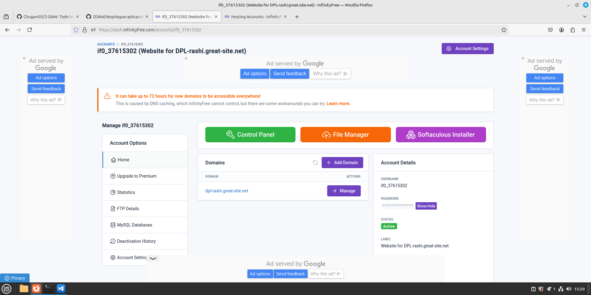
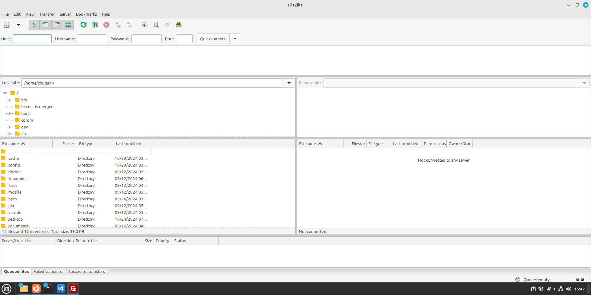
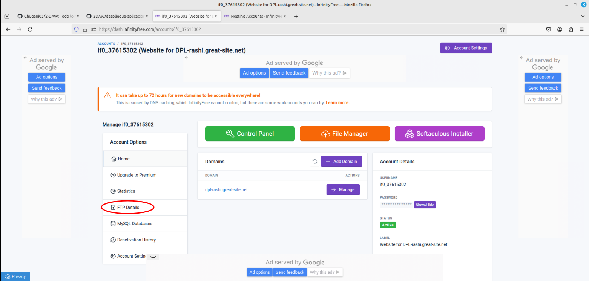
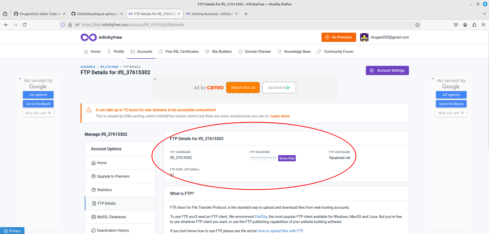
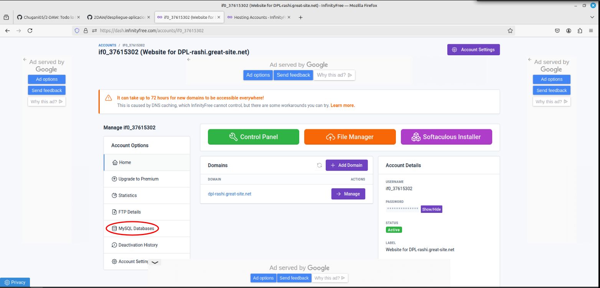

# Migración de Xampp a InfinityFree
<div align=center>

</div>

## Contenido
- [Creación de la cuenta en InfinityFree](#creación-de-la-cuenta-en-infinityfree)
- [Instalación de FileZilla](#instalación-de-filezilla)
- [Vinculación de InfinityFree a Filezilla](#vinculación-de-infinityfree-a-filezilla)
- [MySQL Database en InfinityFree](#mysql-database-en-infinityfree)
- [Adaptación de ficheros](#adaptación-de-ficheros)
- [Migración de ficheros](#migración-de-ficheros)

## Creación de la cuenta en InfinityFree
Al iniciar sesión se nos abre esta pestaña en la que podemos crear cuentas con hacer clic en el botón de `Create Account`.
<div align=center>
    
</div>

Al acabar de cear la cuenta se nos abre el panel de control de la cuenta que acabamos de crear.
<div align=center>
    
</div>

## Instalación de FileZilla
Instalamos FileZilla mediante el comando:
```
apt install filezilla
```

La ejecutamos con el comando:
```
filezilla
```

Que nos abre la siguiente pestaña.
<div align=center>
    
</div>

## Vinculación de InfinityFree a Filezilla
Empezamos la vinculación accediendo a `FTP Details` en `Account Options`.
<div align=center>
    
</div>

Esto nos muestra nuestros datos del `FTP Details`
<div align=center>
    
</div>

## MySQL Database en InfinityFree
<div align=center>
    
</div>

## Adaptación de ficheros

## Migración de ficheros