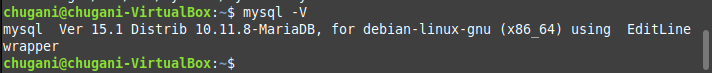
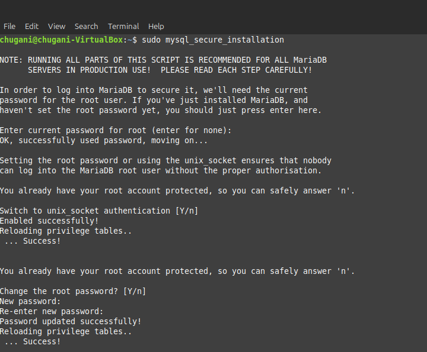
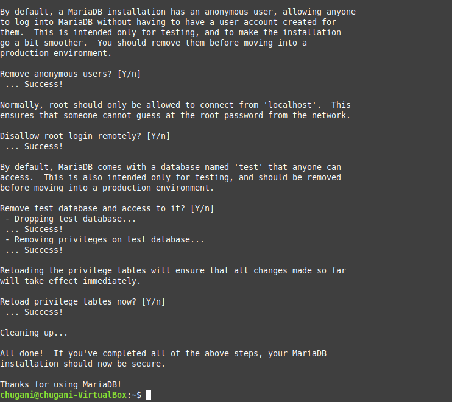
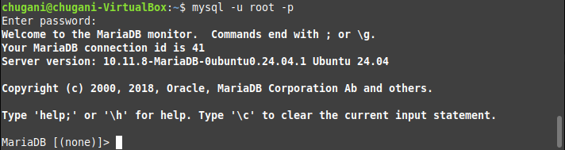
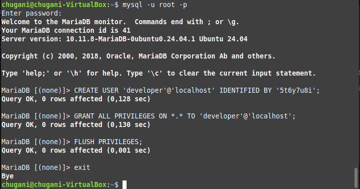
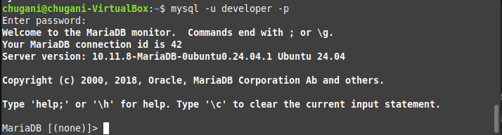

# LAMP en Ubuntu Server
<div align=center>
    
</div>

## Contenido

## Instalación en Ubuntu Server

1. **Actualizar el sistema:**

    Para garantizar que el sistema esté al día con las últimas actualizaciones de seguridad y mejoras, se ejecutan los siguientes comandos:

    ```sh
    sudo apt update
    sudo apt upgrade
    ```

2. **Instalación del servidor Apache:**

    Para instalar el servidor web Apache, lo haremos como la hemos echo en la [anterior tarea](../tarea08/README.md#instalación-y-configuración-básica).

3. **Instalación del servidor de base de datos MaríaDB:**

    3.1. MariaDB se instala con el siguiente comando:

    ```sh
    sudo apt install mariadb-server mariadb-client
    ```

    3.2. Después de la instalación, el servidor MariaDB se inicia automáticamente. Para comprobar el estado del servidor, se utiliza el siguiente comando:

    ```sh
    sudo systemctl status mariadb
    ```

    <div align=center>
        
    </div>

    3.3. Para asegurarnos de que MariaDB se inicie automáticamente al arrancar el sistema, ejecutamos:

    ```sh
    sudo systemctl enable mariadb
    ```

    3.4. Para verificar la versión instalada de MariaDB, se utiliza el siguiente comando:

    ```sh
    mysql -V
    ```

    <div align=center>
        
    </div>

    3.5. Ejecutamos el script de seguridad de MariaDB con el siguiente comando:

    ```sh
    sudo mysql_secure_installation
    ```

    Durante este proceso, se nos pedirá que configuremos la contraseña de root. Inicialmente, pulsamos Intro para dejarla vacía y luego ingresamos la nueva contraseña. A continuación, respondemos a las preguntas para eliminar el usuario anónimo, deshabilitar el inicio de sesión remoto de root y eliminar la base de datos de prueba.

    <div align=center>
        
        
    </div>

    ---

    **Autenticación con unix_socket**

    Por defecto, MariaDB utiliza unix_socket para autenticar el inicio de sesión del usuario root. Esto significa que el usuario root puede conectarse a la base de datos sin necesidad de una contraseña, siempre que esté utilizando el mismo usuario del sistema operativo. Esto proporciona una capa adicional de seguridad, ya que solo los usuarios con acceso al sistema pueden acceder a la base de datos como root.

    ---

    3.6. Para probar el acceso a la base de datos con la nueva contraseña, utilizamos el siguiente comando:

    ```sh
    mysql -u root -p
    ```

    <div align=center>
        
    </div>

    3.7. Para crear un nuevo usuario llamado `developer` con la contraseña `5t6y7u8i`, se utilizan los siguientes comandos:

    ```sql
    CREATE USER 'developer'@'localhost' IDENTIFIED BY '5t6y7u8i';
    GRANT ALL PRIVILEGES ON *.* TO 'developer'@'localhost';
    FLUSH PRIVILEGES;
    ```

    <div align=center>
        
    </div>

    3.8. Para iniciar sesión en la base de datos con el nuevo usuario creado, utilizamos el siguiente comando:

    ```sh
    mysql -u developer -p
    ```

    <div align=center>
        
    </div>

4. **Instalación de la última versión de PHP:**