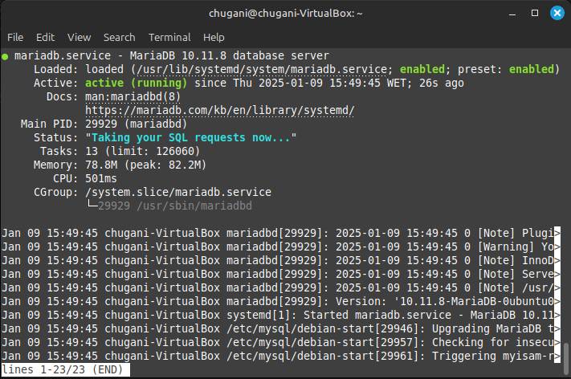

# LAMP en Ubuntu Server
<div align=center>
    
</div>

## Contenido
- [¿Qué es LAMP?](#qué-es-lamp)
  - [Características de LAMP](#características-de-lamp)
  - [Aplicaciones Comunes de LAMP](#aplicaciones-comunes-de-lamp)
- [Instalación en Ubuntu Server](#instalación-en-ubuntu-server)
  - [Sistema Operativo](#sistema-operativo)
  - [Servidor Web: Instalación de Apache](#servidor-web-instalación-de-apache)
  - [Sistema de Gestión de Bases de Datos: Instalación de MaríaDB](#sistema-de-gestión-de-bases-de-datos-instalación-de-maríadb)
  - [Lenguajes de Programación: Instalación de PHP](#lenguajes-de-programación-instalación-de-php)
  - [Ejecutando código PHP en Apache:](#ejecutando-código-php-en-apache)


## ¿Qué es LAMP?

LAMP es un acrónimo que se refiere a un conjunto de tecnologías de software que se utilizan comúnmente para desarrollar y desplegar aplicaciones web. El término LAMP representa las siguientes tecnologías:

- **Linux:** Es el sistema operativo en el que se ejecutan las aplicaciones. Linux es conocido por su estabilidad, seguridad y flexibilidad, lo que lo convierte en una opción popular para servidores web.
- **Apache:** Es el servidor web que gestiona las solicitudes de los clientes y sirve contenido web. Apache es uno de los servidores web más utilizados en el mundo, conocido por su robustez y capacidad de configuración.
- **MySQL/MariaDB:** Es el sistema de gestión de bases de datos que almacena y gestiona los datos de la aplicación. MySQL es un sistema de gestión de bases de datos relacional muy popular, mientras que MariaDB es un fork de MySQL que ofrece características adicionales y mejoras de rendimiento.
- **PHP/Python/Perl:** Son los lenguajes de programación utilizados para desarrollar la lógica de la aplicación. PHP es el más común en el stack LAMP, especialmente para el desarrollo de aplicaciones web dinámicas. Python y Perl también se pueden utilizar en lugar de PHP, dependiendo de las necesidades del proyecto.

### Características de LAMP

- **Código Abierto:** Todas las tecnologías que componen LAMP son de código abierto, lo que significa que son gratuitas y pueden ser modificadas y distribuidas por cualquier persona. Esto fomenta una comunidad activa de desarrolladores y una amplia gama de recursos y documentación.
- **Flexibilidad y Escalabilidad:** LAMP es altamente configurable y se puede adaptar a diferentes necesidades y requisitos. Las aplicaciones pueden escalar fácilmente para manejar un mayor tráfico y más datos.
- **Amplia Comunidad y Soporte:** Debido a su popularidad, LAMP cuenta con una gran comunidad de desarrolladores y una abundante cantidad de recursos, tutoriales y foros de soporte. Esto facilita la resolución de problemas y el aprendizaje.
- **Compatibilidad:** LAMP es compatible con una amplia variedad de aplicaciones y frameworks, lo que permite a los desarrolladores elegir las herramientas que mejor se adapten a sus necesidades.

### Aplicaciones Comunes de LAMP

LAMP se utiliza para desarrollar una amplia variedad de aplicaciones web, que incluyen:

- **Sistemas de gestión de contenido (CMS):** Como WordPress, Joomla y Drupal.
- **Aplicaciones web personalizadas:** Para empresas y organizaciones que requieren soluciones específicas.
- **E-commerce:** Plataformas de comercio electrónico como Magento y PrestaShop.
- **Foros y redes sociales:** Aplicaciones que permiten la interacción entre usuarios.


## Instalación en Ubuntu Server

### Sistema Operativo

Para garantizar que el sistema esté al día con las últimas actualizaciones de seguridad y mejoras, se ejecutan los siguientes comandos:

```sh
sudo apt update
sudo apt upgrade
```

### Servidor Web: Instalación de Apache

Para instalar el servidor web Apache, lo haremos como la hemos echo en la [anterior tarea](../tarea08/README.md#instalación-y-configuración-básica).

### Sistema de Gestión de Bases de Datos: Instalación de MaríaDB

1. **MariaDB se instala con el siguiente comando:**

```sh
sudo apt install mariadb-server mariadb-client
```

2. **Después de la instalación, el servidor MariaDB se inicia automáticamente. Para comprobar el estado del servidor, se utiliza el siguiente comando:**

```sh
sudo systemctl status mariadb
```

<div align=center>
    
</div>

3. **Para asegurarnos de que MariaDB se inicie automáticamente al arrancar el sistema, ejecutamos:**

```sh
sudo systemctl enable mariadb
```

4. **Para verificar la versión instalada de MariaDB, se utiliza el siguiente comando:**

```sh
mysql -V
```

<div align=center>
    
</div>

5. **Ejecutamos el script de seguridad de MariaDB con el siguiente comando:**

```sh
sudo mysql_secure_installation
```

Durante este proceso, se nos pedirá que configuremos la contraseña de root. Inicialmente, pulsamos Intro para dejarla vacía y luego ingresamos la nueva contraseña. A continuación, respondemos a las preguntas para eliminar el usuario anónimo, deshabilitar el inicio de sesión remoto de root y eliminar la base de datos de prueba.

<div align=center>
    
    
</div>

---

**Autenticación con unix_socket**

Por defecto, MariaDB utiliza unix_socket para autenticar el inicio de sesión del usuario root. Esto significa que el usuario root puede conectarse a la base de datos sin necesidad de una contraseña, siempre que esté utilizando el mismo usuario del sistema operativo. Esto proporciona una capa adicional de seguridad, ya que solo los usuarios con acceso al sistema pueden acceder a la base de datos como root.

---

6. **Para probar el acceso a la base de datos con la nueva contraseña, utilizamos el siguiente comando:**

```sh
mysql -u root -p
```

<div align=center>
    
</div>

7. **Para crear un nuevo usuario llamado `developer` con la contraseña `5t6y7u8i`, se utilizan los siguientes comandos:**

```sql
CREATE USER 'developer'@'localhost' IDENTIFIED BY '5t6y7u8i';
GRANT ALL PRIVILEGES ON *.* TO 'developer'@'localhost';
FLUSH PRIVILEGES;
```

<div align=center>
    
</div>

8. **Para iniciar sesión en la base de datos con el nuevo usuario creado, utilizamos el siguiente comando:**

```sh
mysql -u developer -p
```

<div align=center>
    
</div>

### Lenguajes de Programación: Instalación de PHP

1. **Para instalar PHP y algunos módulos comunes, se utiliza el siguiente comando:**

```sh
sudo apt install php
```

2. **Activamos el módulo PHP y reiniciamos el servidor Apache con los siguientes comandos:**

```sh
sudo a2enmod php
sudo systemctl restart apache2
```

3. **Para verificar la versión de PHP instalada, utilizamos el siguiente comando:**

```sh
php --version
```

4. **Para probar los scripts PHP con el servidor Apache, creamos un archivo llamado info.php en el directorio raíz del servidor web:**

```sh
sudo vim /var/www/html/info.php
```

Dentro del archivo, insertamos el siguiente código PHP:

```php
<?php phpinfo(); ?>
```

5. **Una vez guardado el archivo, podemos acceder a él a través del navegador escribiendo la dirección: `http://dirección-ip/info.php`**

<div align=center>
    
</div>

### Ejecutando código PHP en Apache:

Existen dos formas de ejecutar código PHP con el servidor web Apache: utilizando el módulo PHP de Apache o PHP-FPM. En los pasos anteriores, se utilizó el módulo PHP para manejar el código PHP. Sin embargo, en algunos casos, es preferible utilizar PHP-FPM.

1. **Para cambiar a PHP-FPM, primero deshabilitamos el módulo PHP de Apache:**

```sh
sudo a2dismod php8.3
```

2. **Instalamos PHP-FPM con el siguiente comando:**

```sh
sudo apt install php8.3-fpm
```

3. **A continuación, habilitamos los módulos proxy_fcgi y setenvif:**

```sh
sudo a2enmod proxy_fcgi setenvif
```

4. **Habilitamos el archivo de configuración de PHP-FPM:**

```sh
sudo a2enconf php8.3-fpm
```

5. **Finalmente, reiniciamos el servidor Apache para aplicar los cambios:**

```sh
sudo systemctl restart apache2
```

Ahora, si actualizamos la página `info.php` en el navegador, deberíamos ver que la API del servidor ha cambiado de "Apache 2.0 Handler" a "FPM/FastCGI". Esto indica que el servidor web Apache ahora está pasando las solicitudes de PHP a PHP-FPM.

<div align=center>
    
</div>
