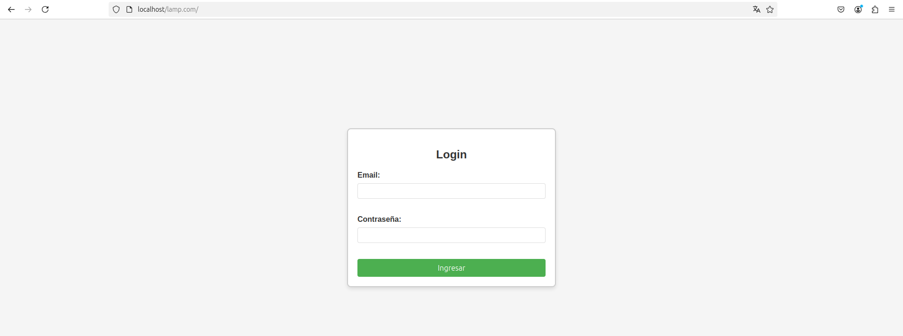
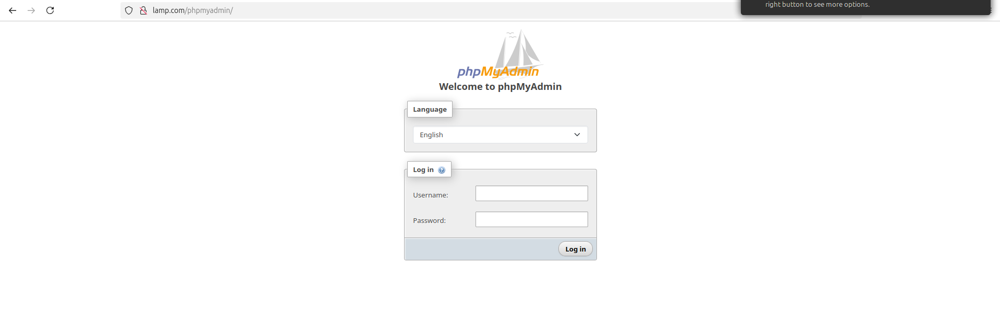

# Instalar en Lamp nuestra página implementada en xampp
<div align=center>
    
</div>

## Contenido

## Crear virtual host

Para comenzar, es necesario configurar un Virtual Host en el archivo de hosts:

```sh
cd /etc
sudo nano hosts
```

Agrega la siguiente línea:

```sh
127.0.0.1   lamp.com
127.0.0.1   www.lamp.com
```

## Copiar los ficheros a una nueva carpeta

A continuación, crea una carpeta para la nueva página y copia todos los archivos necesarios:

```sh
sudo mkdir /var/www/html/lamp.com
sudo cp -r ~/Desktop/2-DAW/Despliegue-de-Aplicaciones-Web/unidad-03/tareas/tarea-07/ /var/www/html/lamp.com/
```

## Editar configuracion de Apache 

Ahora, edita la configuración de Apache para el nuevo Virtual Host:

```sh
cd /etc/apache2/sites-available
sudo nano lamp.com.conf
```

Agrega la siguiente configuración:

```apache
<VirtualHost *:80>
        ServerName lamp.com
        ServerAlias www.lamp.com
        ServerAdmin webmaster@lamp.com
        DocumentRoot /var/www/html/lamp.com
        <Directory /var/www/html/lamp>
                options -Indexes +FollowSymlinks
                AllowOverride All
        </Directory>
        Errorlog ${APACHE_LOG_DIR}/lamp.com-error.log
        CUSTOMLOG ${APACHE_LOG_DIR}/lamp.com-access.log combined
</VirtualHost>
```

Para habilitar el nuevo sitio, ejecuta el siguiente comando:

```sh
sudo a2ensite lamp.com
sudo systemctl reload apache2
```

<div align=center>
    
</div>

## Instalar phpMyAdmin

Instala phpMyAdmin utilizando el siguiente comando:

```sh
sudo apt install phpmyadmin
```

Crea un archivo de configuración para phpMyAdmin:

```sh
cd /etc/apache2/conf-available
sudo nano phpmyadmin.conf
```

Agrega la siguiente configuración:

```apache
Alias /phpmyadmin /usr/share/phpmyadmin

<Directory /usr/share/phpmyadmin>
    Options SymLinksIfOwnerMatch
    DirectoryIndex index.php
</Directory>

# Disallow web access to directories that don't need it
<Directory /usr/share/phpmyadmin/templates>
    Require all denied
</Directory>
<Directory /usr/share/phpmyadmin/libraries>
    Require all denied
</Directory>
<Directory /usr/share/phpmyadmin/setup/lib>
    Require all denied
</Directory>
```

Habilita la configuración de phpMyAdmin:

```sh
sudo a2enconf phpmyadmin.conf
sudo systemctl reload apache2
```

## Crear la base de datos en MariaDB

Accede a MariaDB y crea una nueva base de datos:

```sql
sudo mariadb -u root
CREATE DATABASE phpmyadmin;
```

Accede al panel de control de phpMyAdmin en la siguiente URL: `http://lamp.com/phpmyadmin`

<div align=center>
    
</div>