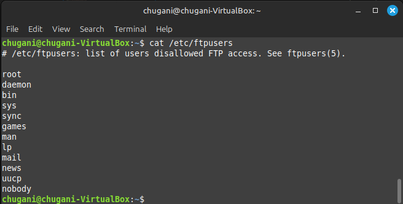

# Instalar de proFTP
<div align=center>
    
</div>

## Contenido
- [Instalación del Servidor FTP](#instalación-del-servidor-ftp)
    - [Actualizar el sistema](#actualizar-el-sistema)
    - [Instalar ProFTPD](#instalar-proftpd)
    - [Verificar el estado del servidor](#verificar-el-estado-del-servidor)
    - [Consultar la versión de ProFTPD](#consultar-la-versión-de-proftpd)
    - [Verificar los usuarios creados durante la instalación](#verificar-los-usuarios-creados-durante-la-instalación)
    - [Listar los archivos de configuración de ProFTPD](#listar-los-archivos-de-configuración-de-proftpd)
    - [Hacer una copia de seguridad del archivo de configuración](#hacer-una-copia-de-seguridad-del-archivo-de-configuración)
- [Configuración del Servidor FTP](#configuración-del-servidor-ftp)
    - [Limpiar el archivo de comentarios y líneas en blanco](#limpiar-el-archivo-de-comentarios-y-líneas-en-blanco)
    - [Revisar el archivo de usuarios restringidos](#revisar-el-archivo-de-usuarios-restringidos)
- [Conexión al Servidor FTP](#conexión-al-servidor-ftp)
    - [Conexión desde la Terminal](#conexión-desde-la-terminal)
        - [Ingresar nombre de usuario y contraseña.](#ingresar-nombre-de-usuario-y-contraseña)
        - [Listar archivos](#listar-archivos)
        - [Consultar directorio actual](#consultar-directorio-actual)
        - [Salir](#salir)
- [Conexión desde el Navegador](#conexión-desde-el-navegador)
- [Conexión desde FileZilla](#conexión-desde-filezilla)
    - []()
- [Modificaciones en la Configuración]()
- [Creación de Usuarios Virtuales]()
- [Conexión con el Usuario Virtual]()

## Instalación del Servidor FTP
### Actualizar el sistema
```bash
sudo apt-get update
```

### Instalar ProFTPD
```bash
sudo apt-get install proftpd
```

### Verificar el estado del servidor
```bash
service proftpd status
```

<div align=center>
  
</div>

### Consultar la versión de ProFTPD
```bash
proftpd -v

# OUTPUT: ProFTPD Version 1.3.8b
```

### Verificar los usuarios creados durante la instalación
```bash
cat /etc/passwd
```

<div align=center>
  
</div>

### Listar los archivos de configuración de ProFTPD
```bash
ls /etc/proftpd
```

<div align=center>
  
</div>

### Hacer una copia de seguridad del archivo de configuración
```bash
sudo cp /etc/proftpd/proftpd.conf /etc/proftpd/proftpd.conf.copia
```

## Configuración del Servidor FTP
### Limpiar el archivo de comentarios y líneas en blanco
```bash
# accedemos al fichero
sudo vi /etc/proftpd/proftpd.conf

# elimina las líneas que son comentarios
:g/^#/d       

# elimina las líneas vacías
:g/^$/d

# guardar y salir
:wq
```

### Revisar el archivo de usuarios restringidos
```bash
cat /etc/ftpusers
```

<div align=center>
  
</div>

## Conexión al Servidor FTP
### Conexión desde la Terminal
```bash
ftp 127.0.0.1
```

#### Ingresar nombre de usuario y contraseña.
```bash
Name (127.0.0.1:chugani): chugani
Password: ********
```
   
#### Listar archivos
```bash
ftp> ls
```

<div align=center>
  
</div>

#### Consultar directorio actual
```bash
ftp> pwd
```

<div align=center>
  
</div>

#### Salir

```bash
ftp> quit
```

<div align=center>
  
</div>

## Conexión desde el Navegador
En el navegador abrimos el siguente enlace: `ftp://127.0.0.1`.

## Conexión desde FileZilla
Si no tienes instalado FileZilla, puedes ver como se hace la instalación en la [anterior tarea](../../../unidad-03/tareas/tarea-07/README.md#instalación-de-filezilla). 

Configurar servidor, nombre de usuario, contraseña y puerto (21).

## Modificaciones en la Configuración
### Modificar proftpd.conf
```bash
nano /etc/proftpd/proftpd.conf
```
Cambiar ServerName y otras configuraciones según se requiera.

### Verificar registros de acceso
```bash
tail -n 15 /var/log/proftpd/proftpd.log

tail -n 15 /var/log/proftpd/xfer.log
```

### Agregar mensajes de bienvenida y error
```bash
AccessGrantMSG "Bienvenido al servidor FTP de (mi_nombre)"

AccessDenyMSG "Error de entrada a mi servidor FTP"
```

### Modificar DefaultRoot
```bash
DefaultRoot ~
```

### Reiniciar el servicio para aplicar cambios
```bash
service proftpd reload
```

## Creación de Usuarios Virtuales
### Incluir módulos en proftpd.conf
```bash
Include /etc/proftpd/modules.conf

Require ValidShell off

AuthUser File /etc/proftpd/ftpd.passwd
```

### Crear directorio para el usuario:
```bash
mkdir /var/ftp/carpetauser1JSR
```

### Crear archivo de contraseñas
```bash
touch /etc/proftpd/ftpd.passwd
```

### Crear un usuario virtual
```bash
ftpasswd --passwd --name=user1JSR --uid=3000 --gid=3000 --home=/var/ftp/
```

### Desbloquear el usuario
```bash
ftpasswd --passwd --name=user1JSR --unlock
```

### Crear un archivo de prueba en el directorio del usuario
```bash
cd /var/ftp/carpetauser1JSR

nano pn.txt
```

## Conexión con el Usuario Virtual
```bash
Servidor: ip_servidor
Nombre de usuario: user1JSR
Contraseña: la que se configuró.
```
