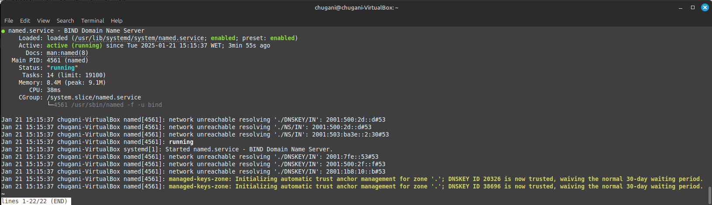
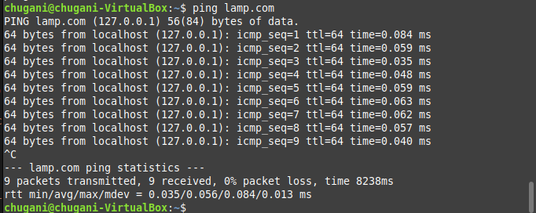

# Instalación de DNS en Ubuntu Server
<div align=center>
    
</div>

## Contenido 
- [Contenido](#contenido)
- [Introducción](#introducción)
- [Instalación de BIND9](#instalación-de-bind9)
- [Configuración de BIND9](#configuración-de-bind9)
- [Configuración de Zonas](#configuración-de-zonas)
  - [Zona Directa](#zona-directa)
  - [Zona Inversa](#zona-inversa)
- [Verificación de Zonas](#verificación-de-zonas)
- [Pruebas de Resolución de Nombres](#pruebas-de-resolución-de-nombres)


## Introducción

En este informe se detalla el proceso de instalación y configuración de un servidor DNS utilizando BIND9 en un sistema operativo Ubuntu Server. BIND (Berkeley Internet Name Domain) es uno de los servidores DNS más utilizados en el mundo, y su configuración adecuada es esencial para la resolución de nombres en redes locales y en Internet.

## Instalación de BIND9

Para comenzar, se debe instalar el paquete BIND9 en el servidor Ubuntu. Esto se puede hacer ejecutando los siguientes comandos en la terminal:

```sh
sudo apt-get install bind9
```

Una vez instalado, se inicia el servicio y se habilita para que se inicie automáticamente al arrancar el sistema:

```sh
sudo systemctl start bind9
sudo systemctl enable bind9
```

Para verificar que el servicio está funcionando correctamente, se puede usar el siguiente comando:

```sh
systemctl status bind9
```

<div align=center>
    
</div>

Además, es necesario permitir el tráfico de DNS a través del firewall:

```sh
sudo ufw allow bind9

# Output: 
# Rules updated
# Rules updated (v6)
```

## Configuración de BIND9

La configuración de BIND9 se realiza principalmente a través de archivos de configuración ubicados en el directorio `/etc/bind/`. El primer archivo que se debe modificar es `named.conf.options`, donde se especifican las opciones de escucha y las consultas permitidas:

```sh
sudo nano /etc/bind/named.conf.options
```

El contenido del archivo debe ser el siguiente:

```conf
listen-on { any; };
allow-query { localhost; 10.10.20.0/24; };
forwarders {
        8.8.8.8;
        8.8.4.4;
};
dnssec-validation no;
```

A continuación, se debe modificar el archivo `named` para forzar el uso de IPv4:

```sh
sudo nano /etc/default/named
```

El contenido debe ser:

```sh
# Antiguo: OPTIONS="-u bind"
OPTIONS="-u bind -4"
```

Después de realizar estos cambios, es importante verificar la configuración:

```sh
sudo named-checkconf
```

Si no hay errores, se reinicia el servicio de BIND9:

```sh
sudo systemctl restart bind9
```

Y se verifica nuevamente el estado del servicio:

```sh
systemctl status bind9
```

## Configuración de Zonas

El siguiente paso es definir las zonas que el servidor DNS manejará. Esto se hace editando el archivo `named.conf.local`:

```sh
sudo nano /etc/bind/named.conf.local
```

El contenido del archivo debe incluir las zonas directas e inversas:

```conf
zone "lamp.com" IN {
        type master;
        file "/etc/bind/zonas/db.lamp.com";
};

zone "99.109.10.in-addr.arpa" {
        type master;
        file "/etc/bind/zonas/db.10.109.99";
};
```

A continuación, se crea el directorio donde se almacenarán los archivos de zona:

```sh
sudo mkdir /etc/bind/zonas
```

### Zona Directa

Se crea el archivo para la zona directa:

```sh
sudo nano /etc/bind/zonas/db.lamp.com
```

El contenido del archivo debe ser:

```conf
$TTL    1D
@       IN      SOA     ns1.lamp.com. admin.lamp.com. (
        1               ; Serial
        12h             ; Refresh
        15m             ; Retry
        3w              ; Expire
        2h  )           ; Negative Cache TTL

;       Registros NS

        IN      NS      ns1.lamp.com.
ns1     IN      A       10.109.99.65
www     IN      A       10.109.99.65
```

### Zona Inversa

Se crea el archivo para la zona inversa:

```sh
sudo nano /etc/bind/zonas/db.99.109.10
```

El contenido del archivo debe ser:

```conf
$TTL    1d ;
@       IN      SOA     ns1.lamp.com admin.lamp.com. (
                        20210222        ; Serial
                        12h             ; Refresh
                        15m             ; Retry
                        3w              ; Expire
                        2h      )       ; Negative Cache TTL
;
@      IN      NS      ns1.lamp.com.
1       IN      PTR     www.lamp.com.
```

## Verificación de Zonas

Es importante verificar que las zonas se hayan configurado correctamente. Esto se puede hacer con los siguientes comandos:

```sh
sudo named-checkzone lamp.com /etc/bind/zonas/db.lamp.com
# Output:
# zone lamp.com/IN: loaded serial 1
# OK

sudo named-checkzone db.10.109.99.in-addr.arpa /etc/bind/zonas/db.99.109.10
# Output:
# zone db.10.109.99.in-addr.arpa/IN: loaded serial 20210222
# OK
```

Si ambos comandos devuelven "OK", significa que las configuraciones de las zonas son correctas.

## Pruebas de Resolución de Nombres

Finalmente, para asegurarse de que el servidor DNS está funcionando correctamente, se puede realizar una prueba de resolución de nombres utilizando el comando ping:

```sh
ping lamp.com
```

Si la configuración es correcta, deberías recibir respuestas desde la dirección IP configurada (10.109.99.65).

<div align=center>
    
</div>