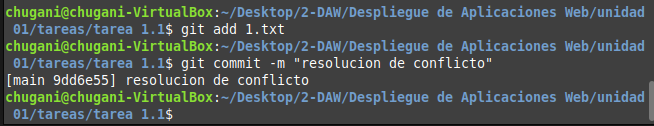
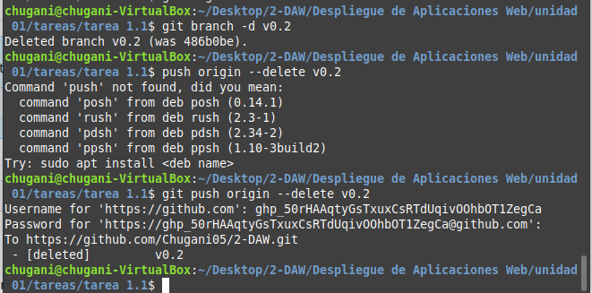
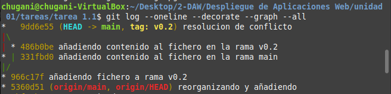
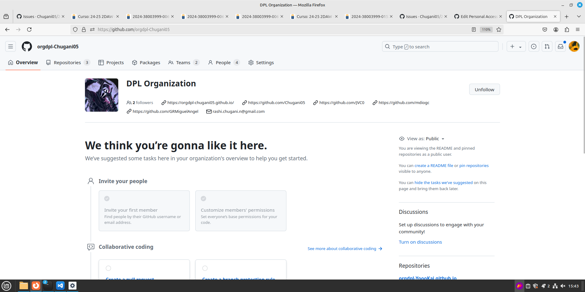
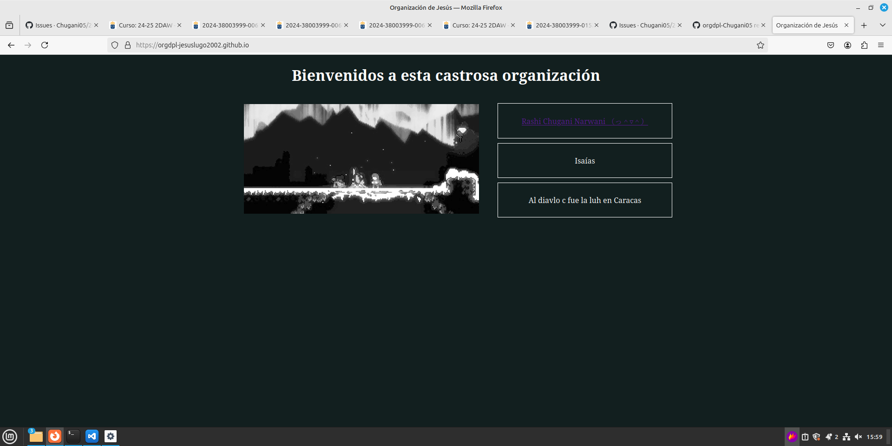
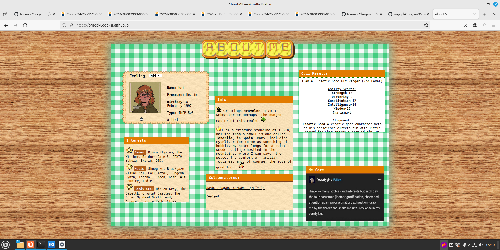
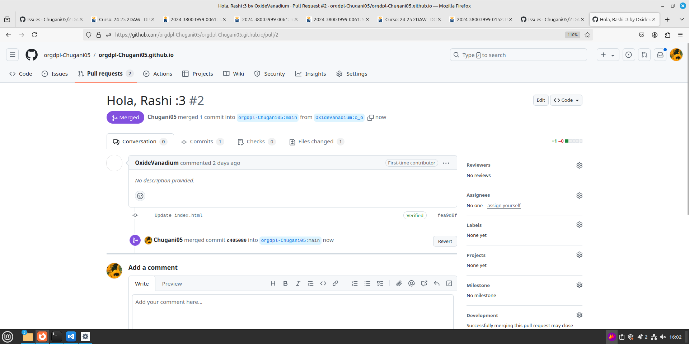

# Trabajando con Git y MarkDown II

<div align=center>
    
</div>

## Contenidos
- [Comandos utilizados](#comandos-utilizados)
- [Creación de organización](#crear-una-organización)

### Comandos utilizados
Los unicos comandos que he utilizado hasta ahora han sido los siguientes:

1. Creación de la rama v0.2 y posicionamiento de carpeta de trabajo en esta rama:
```bash
git branch v0.2
git checkout v0.2
```

2. Añadiendo fichero 2.txt:
```bash
touch 2.txt
git add 2.txt
git commit -m "añadiendo fichero a rama v0.2"
```

3. Creación de una rama remota v0.2 y subir los cambios:
```bash
git push origin v0.2
```

4. Merge directo:
```bash
# posicionarte en la rama master
git checkout main

# hacer el merge
git merge v0.2
```

5. Merge con conflicto:
```bash
# añadiendo contenido al fichero de la rama master y hacer el commit
nano 1.txt
git add 1.txt
git commit -m "añadiendo contenido al fichero en la rama main"

# añadiendo contenido al fichero de la rama v0.2 y hacer el commit
git checkout v0.2
nano 1.txt
git add 1.txt
git commit -m "añadiendo contenido al fichero en la rama v0.2"

# se hace el merge desde la rama master
git checkout main
git merge v0.2
```

6. Listado de ramas:
```bash
git branch --no-merged
```

7. Arreglar el conflicto anterior y hacer un commit:
```bash
git add 1.txt
git commit -m "resolucion de conflicto"
```
<div align=center>
    
</div>

8. Barrando rama v0.2:
```bash
# creación del tag
git tag v0.2

# borrado de rama 
git branch -d v0.2
git push origin --delete v0.2
```
<div align=center>
    
</div>

9. Listado de cambios listando los distintos commits con sus ramas y sus tags:
```bash
git log --oneline --decorate --grapg --all
```
<div align=center>
    
</div>

### Crear una organización
1. Crea una organización llamada orgdpl-tunombredeusuariodegithub
<div align=center>
    
</div>

2. Crear dos equipos en la organización, uno llamado administradores con más permisos y otro colaboradores con menos permisos.
<div align=center>
    
</div>

3. Crear un index.html que se pueda ver como página web en la organización.
<div align=center>
    
</div>

4. Hacer 2 forks de 2 repositorios orgdpl-tunombredeusuariodegithub.github.io de 2 organizaciones de las que sean ni administradores ni colaboradores.
<div align=center>
    
</div>

5. En cada rama modificar el fichero index.html añadiendo vuestro nombre.
<div align=center>
    
</div>
<div align=center>
    
</div>

6. Con cada rama hacer un pull request.
<div align=center>
    
</div>

7. Aceptar los pull request que lleguen a los repositorios de tu organización.
<div align=center>
    
</div>