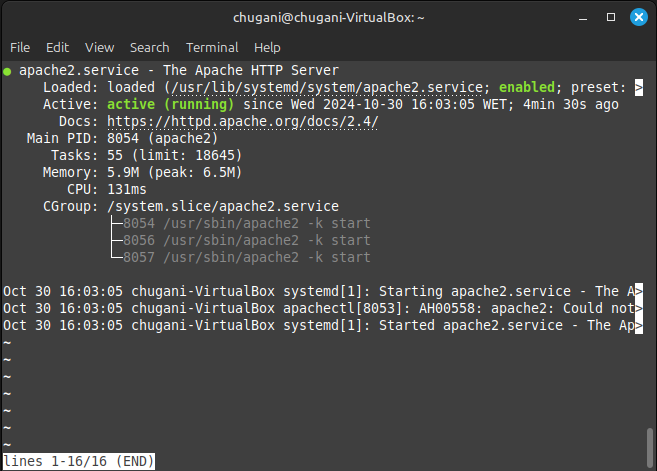
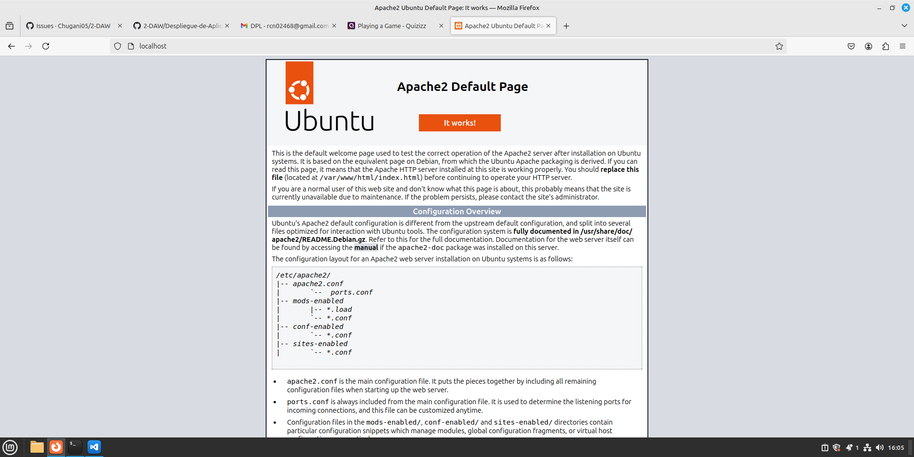
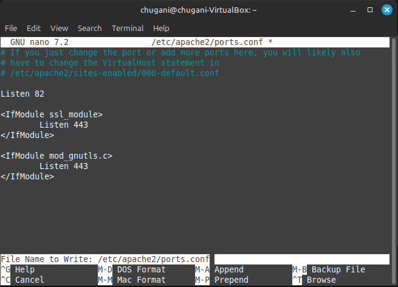
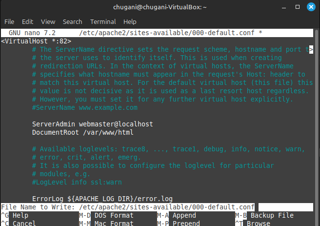
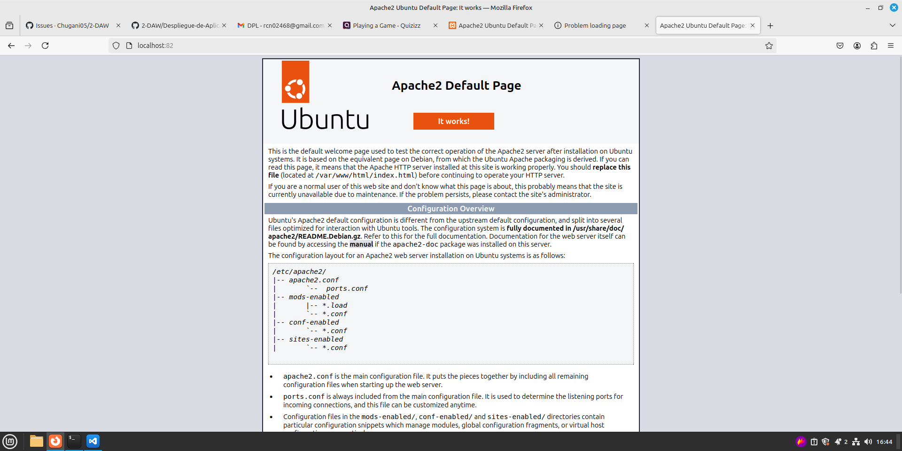
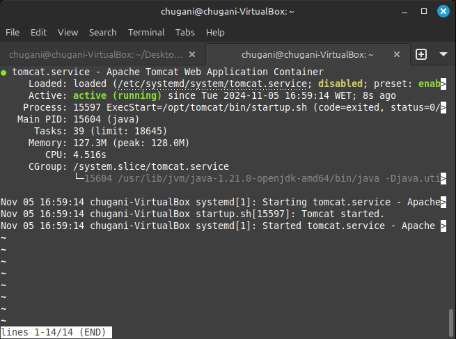

# Instalación de servidor web Apache

<div align=center>
    
</div>

## Contenido
- [Arquitectura Web](#arquitectura-web)
- [Plataforma web](#plataforma-web)
- [Instalación de sistema operativo Ubuntu](#instalación-de-sistema-operativo-ubuntu)
  - [1. Instalación de Apache desde terminal](#1-instalación-de-apache-desde-terminal)
  - [2. Comprobación desde terminal](#2-comprobación-desde-terminal)
  - [3. Comprobación desde navegador](#3-comprobación-desde-navegador)
  - [4. Cambio de puerto](#4-cambio-de-puerto)
  - [5. Instalación de Tomcat](#5-instalación-de-tomcat)
    - [1. Instalación de Java](#1-instalación-de-java)
    - [2. Crear un usuario de Tomcat](#2-crear-un-usuario-de-tomcat)
    - [3. Instalación de Tomcat en Ubuntu](#3-instalación-de-tomcat-en-ubuntu)

## Arquitectura Web
_La arquitectura Web es un modelo compuesto de tres capas, ¿cuáles son y cuál es la función de cada una de ellas?_

La **arquitectura web** se basa en un modelo de tres capas, diseñadas para separar las responsabilidades y mejorar la organización del sistema. Estas capas son:

1. **Capa de presentación**: Es la interfaz de usuario, lo que el usuario final visualiza e interactúa en el navegador. Aquí se procesan los elementos visuales, permitiendo la interacción con la aplicación. Se suelen emplear tecnologías como HTML, CSS y JavaScript.

2. **Capa de lógica de negocio**: Esta capa gestiona la lógica de la aplicación. Aquí se llevan a cabo los procesos y reglas del negocio, es decir, el funcionamiento de las operaciones que necesita realizar el usuario. En el servidor, se usan lenguajes como PHP, Python o Java para construir esta capa.

3. **Capa de datos**: Es donde se almacenan los datos de la aplicación, usualmente en una base de datos. Esta capa es responsable de guardar, recuperar y gestionar la información de manera eficiente. Las bases de datos SQL, como MySQL o PostgreSQL, son ejemplos típicos en esta capa.

## Plataforma web
_Una plataforma web es el entorno de desarrollo de software empleado para diseñar y ejecutar un sitio web; destacan dos plataformas web, LAMP y WISA. Explica en qué consiste cada una de ellas._

Las plataformas web proporcionan un entorno para desarrollar y ejecutar aplicaciones web.

- **LAMP**: Es un conjunto de software de código abierto que incluye **Linux (sistema operativo), Apache (servidor web), MySQL (base de datos)** y **PHP (lenguaje de programación)**. LAMP es muy popular para aplicaciones web en Linux debido a su estabilidad y flexibilidad.
 
- **WISA**: Es una plataforma para el entorno Windows, que incluye **Windows (sistema operativo), IIS (Internet Information Services como servidor web), SQL Server (base de datos)** y **ASP.NET (marco de desarrollo web)**. WISA es ideal para entornos que prefieren soluciones Microsoft, ofreciendo integración con otros productos de esta compañía.
    
## Instalación de sistema operativo Ubuntu
_Dispones de una máquina que cuenta con el sistema operativo Ubuntu 10.04 LTS recientemente actualizado, esta máquina tiene el entorno de red configurado y, además, dispones de conexión a Internet. Además, estás trabajando con la cuenta del usuario root. Indica cada uno de los pasos, y comandos implicados en ellos, para conseguir hacer lo siguiente:_
        
### 1. Instalación de Apache desde terminal
_Instalar el servidor web Apache desde terminal._

Primero, actualizamos la lista de paquetes e instalamos Apache:

```bash
# actualizar paquetes
sudo apt-get update

# instalar Apache
sudo apt-get install apache2 -y
```

### 2. Comprobación desde terminal
_Comprobar que está funcionando el servidor Apache desde terminal._

Para verificar que Apache está activo, utilizamos el siguiente comando:

```bash
systemctl status apache2
```

<div align=center>
  
</div>

### 3. Comprobación desde navegador
_Comprobar que está funcionando el servidor Apache desde navegador._

En el navegador abrimos el siguente enlace: `http://localhost`

<div align=center>
  
</div>

### 4. Cambio de puerto
_Cambiar el puerto por el cual está escuchando Apache pasándolo al puerto 82._

Editamos el archivo de configuración de Apache para cambiar el puerto, buscamos la línea `Listen 80` y la cambiaremos a `Listen 82`:

```bash
sudo nano /etc/apache2/ports.conf
```

<div align=center>
  
</div>

Después, modificamos también el archivo de configuración de sites, cambiando también el puerto 80 a 82 en la línea que comienza con `<VirtualHost *:80>`:

```bash
sudo nano /etc/apache2/sites-available/000-default.conf
```

<div align=center>
  
</div>

Finalmente, reinicia Apache para que se apliquen los cambios:

```bash
sudo systemctl restart apache2
```

<div align=center>
  
</div>

### 5. Instalación de Tomcat
_Instalar el servidor de aplicaciones Tomcat._

#### 1. Instalación de Java

Primero, actualizamos la lista de paquetes e instalamos Java:

```bash
# actualizar paquetes
sudo apt update

# instalar Java
sudo apt install default–jdk
```

Posteriormente comprobamos si se ha instalado:

```bash
java --version
```

#### 2. Crear un usuario de Tomcat

```bash
# nuevo grupo de tomcat para ejecutar el servicio
sudo groupadd tomcat

# nuevo directorio para la ubicación de la configuración 
sudo mkdir /opt/tomcat

# agregamos usuarios al grupo Tomcat
sudo useradd -s /bin/false -g tomcat -d /opt/tomcat tomcat
```

#### 3. Instalación de Tomcat en Ubuntu

Descargamos la última versión:
```bash
curl https://dlcdn.apache.org/tomcat/tomcat-9/v9.0.96/bin/apache-tomcat-9.0.96.tar.gz -o apache-tomcat-9.0.96.tar.gz
```

Extraemos y movemos a nuestro directorio `/opt/tomcat`:
```bash
# extraemos del archivo comprimido
sudo tar -zxvf apache-tomcat-*.tar.gz

# movemos al directorio
sudo mv apache-tomcat-*/* /opt/tomcat/
```

Cambiamos la propiedad al usuario Tomcat para que pueda escribir en los ficheros
```bash
sudo chown -R tomcat:tomcat /opt/tomcat/
```

#### 4. Configuración del Tomcat

Encuentramos la ruta en la q está instalado Java en nuestro sistema:
```bash
sudo update-java-alternatives -l

# OUTPUT: java-1.21.0-openjdk-amd64      2111       /usr/lib/jvm/java-1.21.0-openjdk-amd64
```

Crearemos un fichero `systemd` para Tomcat con el siguiente comando:
```bash
sudo nano /etc/systemd/system/tomcat.service
```

Y agregamos la siguiente información:
```txt
[Unit]
Description=Apache Tomcat Web Application Container
Wants=network.target
After=network.target
[Service]
Type=forking
Environment=JAVA_HOME=/usr/lib/jvm/java-1.21.0-openjdk-amd64
Environment=CATALINA_PID=/opt/tomcat/temp/tomcat.pid
Environment=CATALINA_HOME=/opt/tomcat
Environment='CATALINA_OPTS=-Xms512M -Xmx1G -Djava.net.preferIPv4Stack=true'
Environment='JAVA_OPTS=-Djava.awt.headless=true'
ExecStart=/opt/tomcat/bin/startup.sh
ExecStop=/opt/tomcat/bin/shutdown.sh
SuccessExitStatus=143
User=tomcat
Group=tomcat
UMask=0007
RestartSec=10
Restart=always
[Install]
WantedBy=multi-user.target
```

Y recargamos `systemd daemon`:
```sh
sudo systemctl daemon-reload
```

#### 5. Comprobación de Tomcat

```bash
#  inicia el servicio
sudo systemctl start tomcat

# muestra el estado actual del servicio
systemctl status tomcat
```

<div align=center>
  
</div>