# Confuguración de Xaamp

<div align=center>
    
</div>

## Contenido
- [Inicialización de Xampp](#inicialización-de-xampp)
- [Cambio de contraseña root](#cambio-de-contraseña-root)
- [Creación de nuevo usuario](#creación-de-nuevo-usuario)

## Inicialización de Xampp
### Utilizando el siguiente comando abrimos el panel de control de xampp.
```bash
sudo /opt/lampp/manager-linux-x64.run
```
<div align=center>
    
</div>


### En la parte de `Manage Servers`, iniciamos los servidores apretando el boton de `Start all`.
<div align=center>
    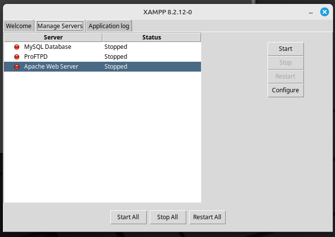
</div>

## Cambio de contraseña root
### A continuación, en internet buscamos `localhost`, y se nos abrira esta página. Aquí pinchamos en `phpMyAdmin`.
<div align=center>
    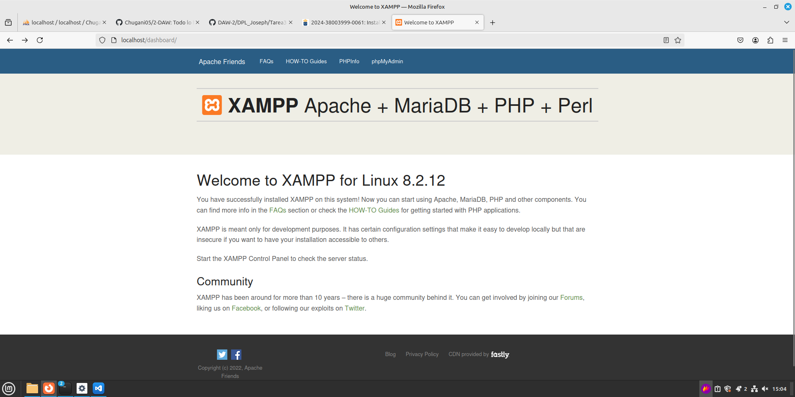
</div>

### Vamos al apartado de `User accounts`.
<div align=center>
    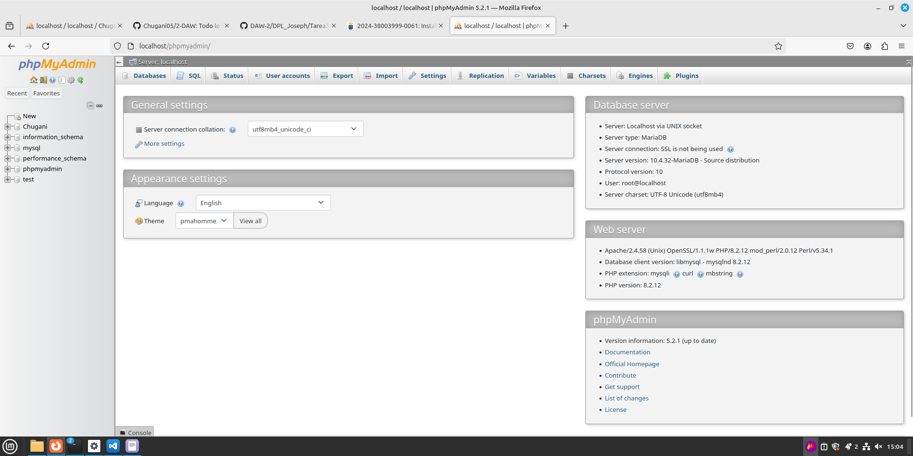
</div>

### Llegados a este ponto lo que queremos hacer es darle todos los privilegios al usuario root. Asi que buscamos donde el `user name` sea `root` y el `host name` sea `localhost`, y pinchamos en `edit privileges`.
<div align=center>
    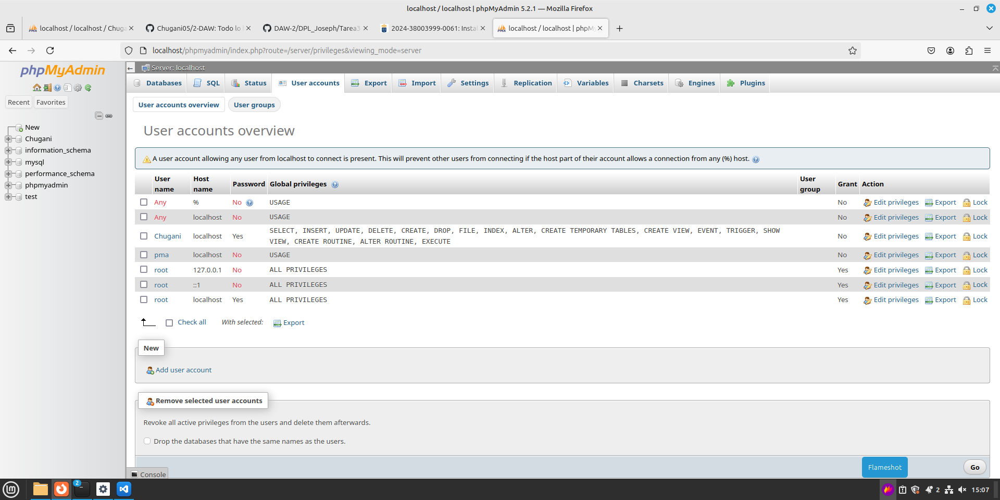
</div>

### Estando en esta página, pinchamos en `change password` 
<div align=center>
    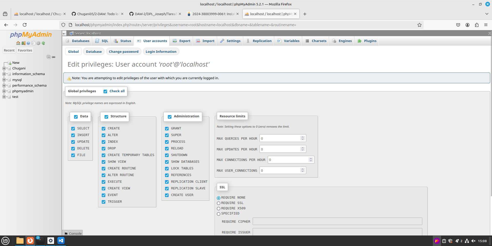
</div>

### Añadimos una contraseña a nuestro usuario root. Esto nos dará un error que correguiremos a continuación.
<div align=center>
    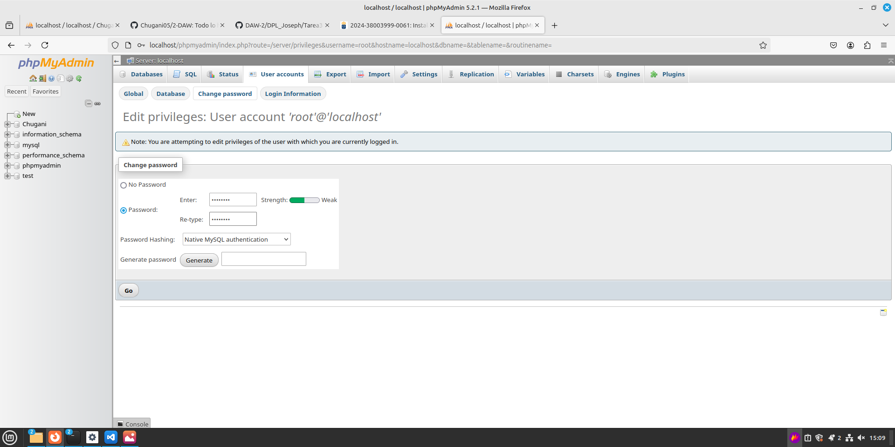
</div>

### Lo primero es ir a la pane de control de Xampp pinchar en `Open Application Folder`
<div align=center>
    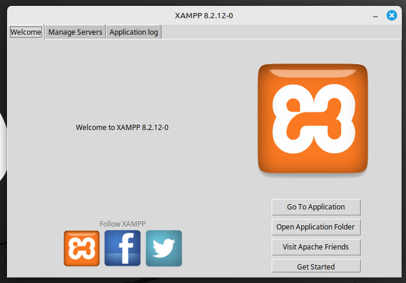
</div>

### Se abre esta carpeta, en la que abrimos el archivo seleccionado `config.inc.php`.
<div align=center>
    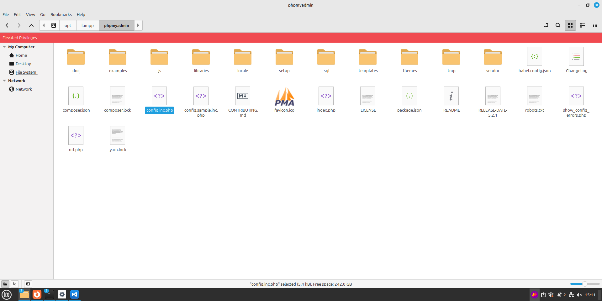
</div>

### Dentro del fichero buscamos `$cfg['Server'][$i]['password'] = '';` y dentro de las comillas vacias ponemos la contraseña que le hayamos puesto al usuario root.
<div align=center>
    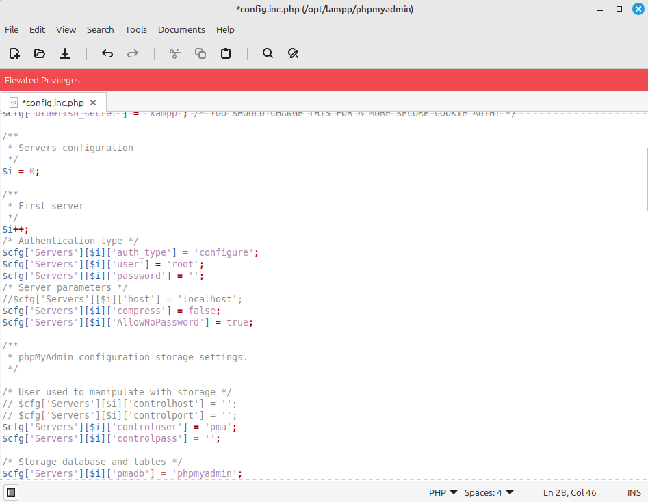
</div>

### Para acabar de arreglar el error, reiniciamos los servidores con el boton `Restart all`. Esto arregla el error en la página de localhost.
<div align=center>
    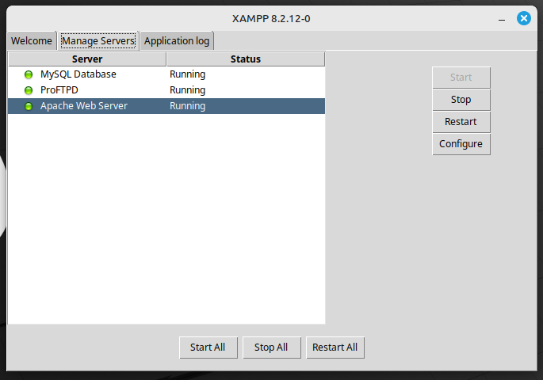
</div>

## Creación de nuevo usuario
### Volvemos al aprtado de `User accounts` y creamos un usuario nuevo. En la parte del `login information`, en `user name` ponemos en nombre del usuario, en `host name` cambiamos a `local` y ponemos `localhost`de nombre del host, y añadimos la contraseña del usuario. En la parte de `Datebase for user account` hacemos tick en `create a database with same name and grant all privileges`.
<div align=center>
    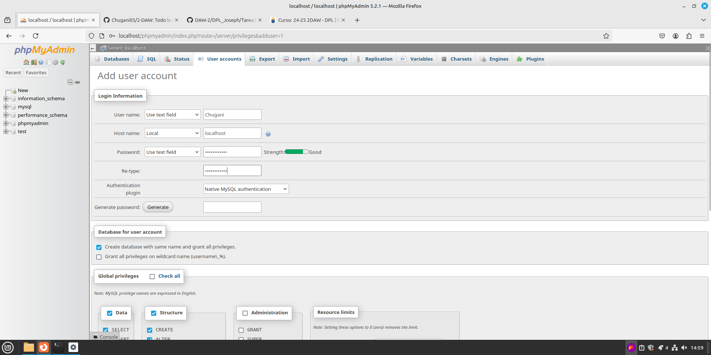
</div>

### Hacemos tick en la parte de `Data`y `Structure`.
<div align=center>
    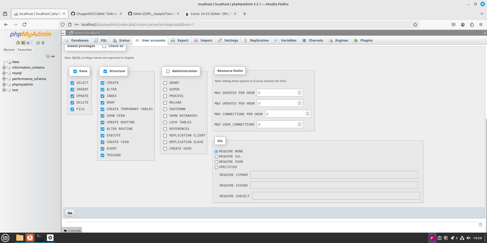
</div>

### Llegados a este punto, ya tenemos el usuario creado. Lo último que nos queda por hacer es cambiar una cosa en el fichero de configuración.
<div align=center>
    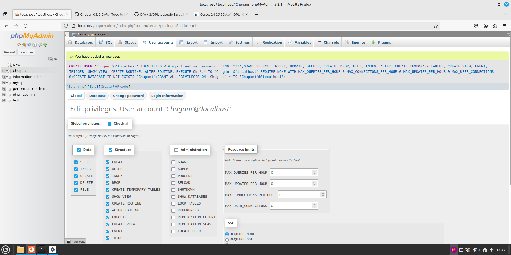
</div>

### Dentro del fichero buscamos `$cfg['Server'][$i]['auth-type'] = 'configure';` y dentro de las ultimas comillas cambiamos y ponemos `http`.
<div align=center>
    
</div>

### Desde ahora, cada vez que queramos entrar a `localhost` nos preguntara que usuario es con el que queremos entrar.
<div align=center>
    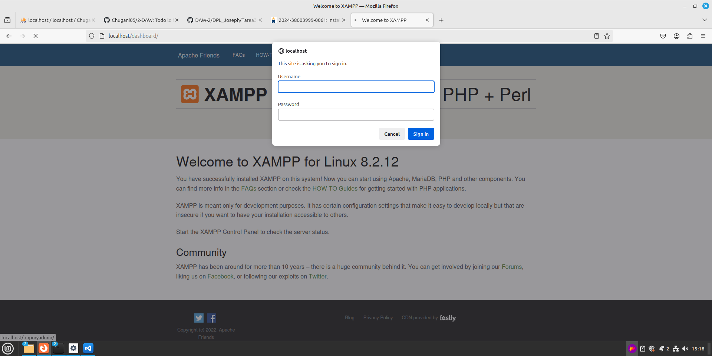
</div>