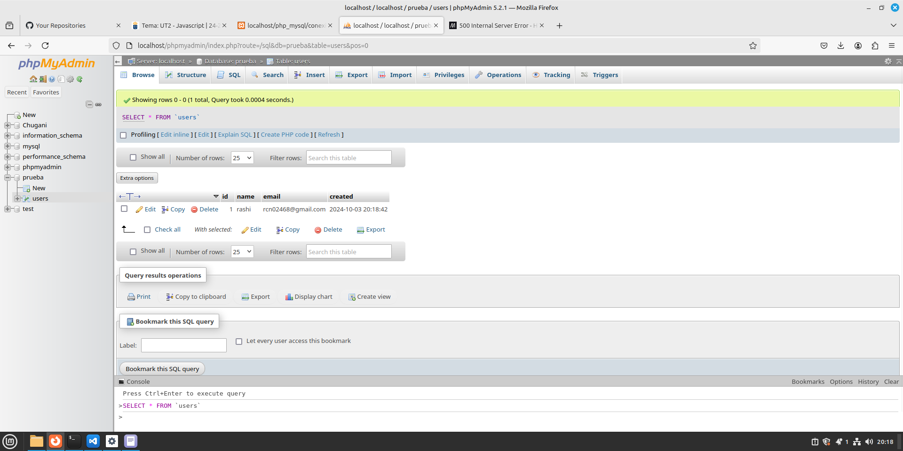
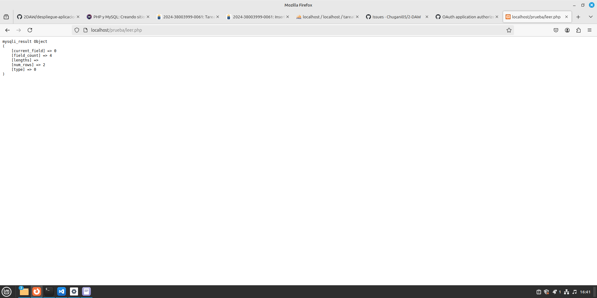
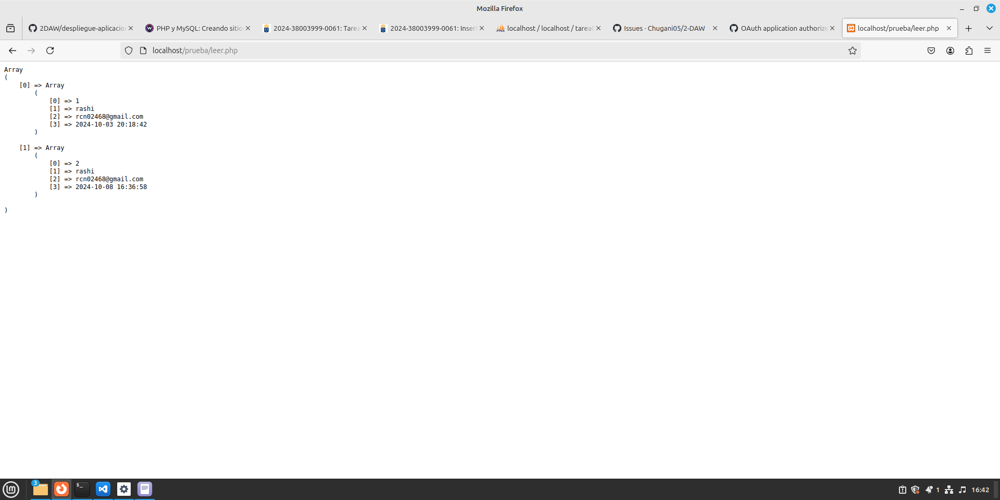
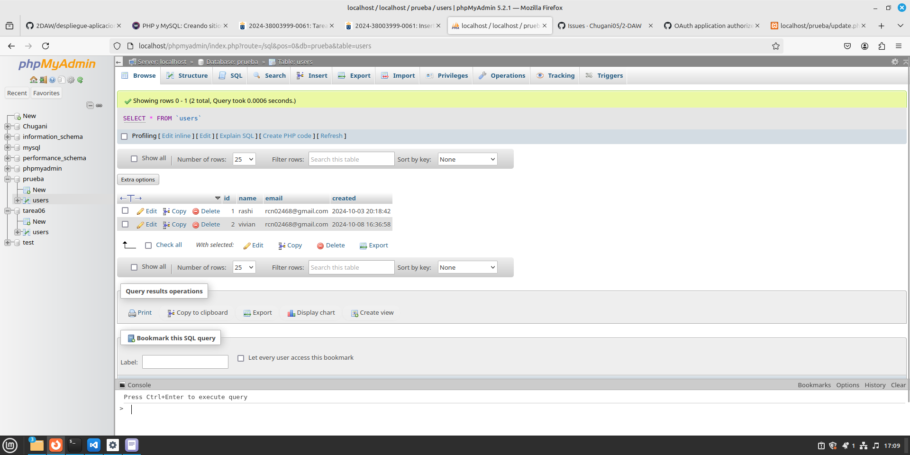

# Registros en la base de datos.

<div align=center>
    
</div>

## Contenido
- [Inserción de datos en la base de datos.](#inserción-de-datos-en-la-base-de-datos)
- [Leer registros de la base de datos.](#leer-registros-de-la-base-de-datos)
- [Actualizar la base de datos.](#actualizar-la-base-de-datos)
- [Borrar la base de datos.](#borrar-la-base-de-datos)

## Inserción de registros en la base de datos.
Cambiamos y añadimos contenido al documento de conexión.

```php
<?php

    echo "<pre>";

    $conn = mysqli_connect( 'localhost', 'nombreUsuario', 'contraseñaUsuario', 'prueba');

    // sentencia sql para incertar datos en la base de datos
    $insert = "insert into users( name, email) values( 'rashi', 'rcn02468@gmail.com')";

    // ejecuta una consulta en la base de datos
    $return = mysqli_query ( $conn, $insert);

    // muestra el valor de la sentencia por pantalla
    print_r( ( $return));

    // cerramos la conecion al servidor
    mysqli_close( $conn)

?>
```

Comprobamos que los datos hayan sido insertado en `phpMyAdmin`.

<div align=center>
    
</div>

## Leer registros de la base de datos.
Leemos los datos con `mysqli_query` en un archivo que llamamos `leer.php`.

```php
<?php
echo "<pre>";

$conn = mysqli_connect('localhost', 'nombreUsuario', 'contraseñaUsuario', 'prueba');

$sql = 'select id, name, email, created from users';
$result = mysqli_query($conn, $sql);
print_r($result);

?>
```

<div align=center>
    
</div>

Esta es la segunda forma leer datos, mediante `mysqli_fetch_all`.

```php
<?php
echo "<pre>";

$conn = mysqli_connect('localhost', 'nombreUsuario', 'contraseñaUsuario', 'prueba');

$sql = 'select id, name, email, created from users';
$result = mysqli_query($conn, $sql);
$rows = mysqli_fetch_all($result);
print_r($rows);

?>
```
<div align=center>
    
</div>


Esta es la tercera forma de leer datos, muy similar a la segunda pero con un bucle `do`.

```php
<?php
$conn = mysqli_connect('localhost', 'nombreUsuario', 'contraseñaUsuario', 'prueba');

$sql = 'select id, name, email, created from users';
$result = mysqli_query($conn, $sql);
$rows = mysqli_fetch_array($result, MYSQLI_NUM);

do {
    $data[] = $rows;
} while ($rows = mysqli_fetch_array($result, MYSQLI_NUM));

echo "<pre>";
print_r($data);

?>
```
<div align=center>
    
</div>

## Actualizar la base de datos.
Actualizamos los datos mediante un archivo `update.php` con el siguiente código.

```php
<?php

echo "<pre>";
$conn = mysqli_connect('localhost', 'nombreUsuario', 'contraseñaUsuario', 'prueba');

$sql = 'UPDATE users SET name = "vivian" WHERE id = 2';
$result = mysqli_query($conn, $sql);
print_r($result);

mysqli_close($conn);

?>
```

<div align=center>
    
</div>

## Borrar la base de datos.
Borramos los datos mediante un archivo `update.php` con el siguiente código.

```php
<?php

echo "<pre>";
$conn = mysqli_connect('localhost', 'nombreUsuario', 'contraseñaUsuario', 'prueba');

$sql = 'DELETE FROM users WHERE id = 2';
$result = mysqli_query($conn, $sql);
print_r($result);

mysqli_close($conn);

?>
```

<div align=center>
    
</div>