# Interfaces de operaciones con SQL.

<div align=center>
    
</div>

## Contenido
- [Creación de base de datos y tabla.](#creación-de-base-de-datos-y-tabla)
- [Estructura y funcionamiento](#estructura-y-funcionamiento)
    - [index.php](#indexphp)
    - [sql_get.php](#sql_getphp)
    - [sql_post.php](#sql_postphp)
    - [script.js](#scriptjs)
    - [style.css](#stylecss)
- [Inserción de registros](#inserción-de-registros)
- [Actualización de registros.](#actualización-de-registros)
- [Eliminación de registros.](#eliminación-de-registros)

## Creación de base de datos y tabla.
Creamos la base de datos, en este caso llamada `tarea06` y la tabla `users`.
<div align=center>
    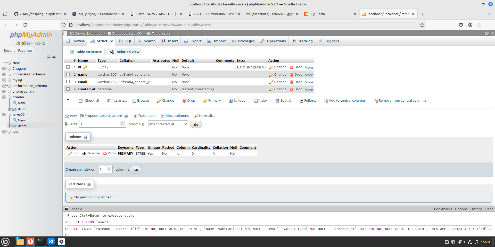
</div>

## Estructura y funcionamiento
### index.php
Esta interfaz basada en PHP permite a los usuarios realizar operaciones SQL (insertar, actualizar, eliminar) en una base de datos:

- **Selección de operación SQL**: Los usuarios eligen la operación (insertar, actualizar, eliminar) mediante un menú desplegable.
- **Formularios**:
  - **Formulario de inserción**: Agrega un nuevo nombre y correo electrónico.
  - **Formulario de actualización**: Actualiza un registro basado en su ID.
  - **Formulario de eliminación**: Elimina un registro basado en su ID.
- **Tabla de resultados**: Muestra el resultado (como la lista de registros) tras realizar la operación.

Los formularios son procesados por `sql_post.php`, donde se maneja la lógica SQL para cada operación. JavaScript muestra/oculta dinámicamente el formulario correspondiente según la selección del usuario.

```php
<!DOCTYPE html>
<html lang="en">
<head>
    <meta charset="UTF-8">
    <meta name="viewport" content="width=device-width, initial-scale=1.0">
    <title>SQL Form</title>
    <link rel="stylesheet" href="css/style.css">
</head>
<body>
    <main>
        <div>
            <h1 id="form-title">SQL Operations Form</h1>
            <label for="sql-query-type">Which operation would you like to perform?:</label>
            <select name="sql-query-type" id="sql-query-type">
                <option value="insert">Insert record</option>
                <option value="update">Update record</option>
                <option value="delete">Delete record</option>
            </select>
            <div id="form-container">
                <form action="sql_post.php" method="post" id="insert-form">
                    <input type="hidden" name="insert">
                    <label for="name">Name: </label><input type="text" name="name" value="" required><br>
                    <label for="email">Email: </label><input type="email" name="email" value="" required><br>
                    <input type="submit" value="Enviar">
                </form>
                <form action="sql_post.php" method="post" id="update-form">
                    <input type="hidden" name="update">
                    <label for="uid">Record ID:  </label><input type="number" name="uid" min="0" value="" required><br>
                    <label for="name">Updated name: </label><input type="text" name="name" value=""><br>
                    <label for="email">Updated email: </label><input type="email" name="email" value=""><br>
                    <input type="submit" value="Enviar">
                </form>
                <form action="sql_post.php" method="post" id="delete-form">
                    <input type="hidden" name="delete">
                    <label for="uid">Record ID:  </label><input type="number" name="uid" min="0" value="" required><br>
                    <input type="submit" value="Enviar">
                </form>
            </div>
        </div>
        <div id="table-container">
            <h1>Resulting Table</h1>
            <table id="result-table">
                <tr>
                    <th>ID</th>
                    <th>Name</th>
                    <th>Email</th>
                    <th>User creation date</th>
                </tr>
            </table>
        </div>
    </main>
   <script type="module" src="js/script.js" type="text/javascript"></script>
</body>
</html>
```

### sql_get.php
Este script PHP:

1. **Conexión a la base de datos**: Se conecta a una base de datos MySQL llamada `tarea06` usando las credenciales de usuario.
2. **Consulta SQL**: Ejecuta la consulta `"SELECT * FROM users"` para obtener todos los registros de la tabla `users`.
3. **Obtención de resultados**: Recupera todos los resultados como un arreglo asociativo.
4. **Devolver los datos**: Convierte los resultados en formato JSON y los imprime.
5. **Cierra la conexión**: Finaliza la conexión a la base de datos.

Este script está diseñado para devolver todos los registros de la tabla `users` en formato JSON.

```php
<?php

$conn = mysqli_connect('localhost', 'nombreUsuario', 'contraseñaUsuario', 'tarea06');

$query = "select * from users";
$result = mysqli_query($conn, $query);
$rows = mysqli_fetch_all($result, MYSQLI_ASSOC);
print json_encode($rows);

mysqli_close($conn);

?>
```

### sql_post.php
Este script PHP realiza diferentes operaciones SQL (insertar, actualizar o eliminar) basadas en la entrada del usuario:

1. **Conexión a la base de datos**: Se conecta a la base de datos `tarea06` usando las credenciales proporcionadas.
2. **Detección de tipo de operación**: Identifica el tipo de operación (`insert`, `update`, `delete`) a partir de los datos enviados en el formulario (`$_POST`).
3. **Construcción de la consulta SQL**:
   - **Insertar**: Agrega un nuevo registro con nombre y correo electrónico en la tabla `users`.
   - **Actualizar**: Actualiza el nombre y/o correo electrónico de un registro existente basado en el `id`.
   - **Eliminar**: Elimina un registro de la tabla basado en el `id`.
4. **Ejecución de la consulta**: Ejecuta la consulta SQL correspondiente en la base de datos.
5. **Redirección**: Después de ejecutar la consulta, espera 3 segundos y redirige a `index.php`.
6. **Cierre de la conexión**: Cierra la conexión a la base de datos. 

El script muestra el mensaje "Updating data..." mientras se procesa la operación y luego redirige al usuario.

```php
<?php

$conn = mysqli_connect("localhost", "nombreUsuario", "contraseñaUsuario", "tarea06");

$queryType = key($_POST);
$query = "";

switch ($queryType) {
    case "insert":
        $name = mysqli_real_escape_string($conn, $_POST["name"]);
        $email = mysqli_real_escape_string($conn, $_POST["email"]);
        $query = "INSERT INTO users(name, email) VALUES('$name', '$email')";
        break;
    case "update":
        $name = mysqli_real_escape_string($conn, $_POST["name"]);
        $email = mysqli_real_escape_string($conn, $_POST["email"]);
        $id = mysqli_real_escape_string($conn, $_POST["uid"]);
        $query = "UPDATE users SET name = '$name', email = '$email' WHERE id = $id";
        break;
    case "delete":
        $id = mysqli_real_escape_string($conn, $_POST["uid"]);
        $query = "DELETE FROM users WHERE id = $id";
        break;
    default:
        die("Invalid query type");
}

$result = mysqli_query($conn, $query);
mysqli_close($conn);

header("refresh: 3; url=index.php");
echo "Updating data...";
```

### script.js
Este script JavaScript realiza las siguientes funciones:

1. **Consulta y renderización de la tabla**:
   - Usa `fetchData()` para obtener datos de un archivo PHP (`sql_get.php`) mediante `fetch`, que devuelve un JSON con los registros.
   - Con los datos obtenidos, llama a `createRow()` para agregar filas en la tabla HTML (`#result-table`), mostrando el ID, nombre, correo y fecha de creación de cada usuario.

2. **Cambio de operación SQL**:
   - Detecta el cambio en el selector de tipo de consulta (`sql-query-type`) y llama a `changeForm()` para mostrar el formulario correspondiente (insertar, actualizar o eliminar) y ocultar los otros.

3. **Mostrar el formulario adecuado**:
   - Basado en el tipo de operación seleccionada:
     - **Insertar**: Muestra el formulario de inserción y oculta los otros.
     - **Actualizar**: Muestra el formulario de actualización y oculta los otros.
     - **Eliminar**: Muestra el formulario de eliminación y oculta los otros.

```js
// Inicialización y consulta de la tabla
const selectResult = await fetchData();

async function fetchData() {
    const response = await fetch("sql_get.php");
    const data = await response.json();
    return data
}

for (let userData of selectResult) {
    createRow(userData);
}

function createRow(data) {
    document.getElementById("result-table").innerHTML += `
    <tr>
        <td>${data.id}</td>
        <td>${data.name}</td>
        <td>${data.email}</td>
        <td>${data.created_at}</td>
    </tr>
    `;
}

// Cambio de operaciones SQL
const sqlQueryTypeSelector = document.getElementById("sql-query-type")
sqlQueryTypeSelector.addEventListener('change', () => {
    console.log
    let queryType = sqlQueryTypeSelector.value
    changeForm(queryType);
})

function changeForm(queryType) {
    switch (queryType) {
        case "insert":
            setInsertForm();
            break;
        case "update":
            setUpdateForm();
            break;
        case "delete":
            setDeleteForm();
            break;
    }
} 

let insertForm = document.getElementById("insert-form");
let updateForm = document.getElementById("update-form");
let deleteForm = document.getElementById("delete-form");

// Operación SQL: Insert
function setInsertForm() {
    insertForm.style.display = "block";
    updateForm.style.display = "none";
    deleteForm.style.display = "none";
}

// Operación SQL: Update
function setUpdateForm() {
    insertForm.style.display = "none";
    updateForm.style.display = "block";
    deleteForm.style.display = "none";
}

// Operación SQL: Delete
function setDeleteForm() {
    insertForm.style.display = "none";
    updateForm.style.display = "none";
    deleteForm.style.display = "block";
}
```

### style.css
Este archivo CSS define el estilo para una página web con formularios y tablas:

1. **Estilos globales**: Resetea el margen del cuerpo, establece una fuente base, color de fondo y texto, y un diseño de línea clara.
   
2. **Diseño principal**: 
   - El contenedor principal (`main`) ocupa toda la altura de la pantalla, alinea el contenido al centro, y tiene un espaciado entre elementos.
   
3. **Contenedor del formulario**:
   - Aplica un borde, esquinas redondeadas, sombras y espaciado interno.
   - Los inputs y selects tienen ancho completo, bordes suaves y relleno.
   - El botón de enviar tiene un fondo verde, texto blanco y efecto hover.

4. **Tabla de resultados**:
   - Define un diseño colapsado, con celdas separadas por bordes suaves y espaciado interno.
   - Los encabezados tienen un fondo gris claro y texto en negrita.

5. **Visibilidad de formularios**: Los formularios de actualización, eliminación e inserción están ocultos por defecto.

6. **Diseño responsivo**: En pantallas pequeñas (menos de 768px), los elementos cambian a una disposición vertical, y los anchos de los contenedores se ajustan al 90%.

```css
/* Global Reset and Base Styles */
body {
    margin: 0;
    font-family: Arial, sans-serif;
    background-color: #f5f5f5;
    color: #333;
    line-height: 1.6;
}

/* Main Layout */
main {
    min-height: 100vh;
    display: flex;
    justify-content: center;
    align-items: center;
    gap: 50px;
    padding: 20px;
    box-sizing: border-box;
    background-color: #fafafa;
}

/* Centered Div Elements */
main div {
    text-align: center;
}

/* Form Container */
#form-container {
    border: 2px solid #ccc;
    border-radius: 8px;
    padding: 20px;
    background-color: #fff;
    box-shadow: 0 4px 8px rgba(0, 0, 0, 0.1);
    max-width: 400px;
    width: 100%;
    text-align: left;
}

#form-container label {
    display: block;
    margin-bottom: 8px;
    font-weight: bold;
}

#form-container input,
#form-container select {
    width: 100%;
    padding: 8px;
    margin-bottom: 15px;
    border: 1px solid #ddd;
    border-radius: 4px;
    box-sizing: border-box;
}

#form-container input[type="submit"] {
    background-color: #4CAF50;
    color: white;
    cursor: pointer;
    border: none;
    padding: 10px 20px;
    border-radius: 4px;
}

#form-container input[type="submit"]:hover {
    background-color: #45a049;
}

/* Result Table Styling */
#table-container {
    max-width: 600px;
    width: 100%;
    background-color: #fff;
    border-radius: 8px;
    padding: 20px;
    box-shadow: 0 4px 8px rgba(0, 0, 0, 0.1);
}

#result-table {
    width: 100%;
    border-collapse: collapse;
    margin-top: 20px;
}

#result-table th, #result-table td {
    padding: 12px;
    border: 1px solid #ddd;
    text-align: left;
}

#result-table th {
    background-color: #f4f4f4;
    font-weight: bold;
}

/* Form Visibility */
#update-form, #delete-form, #insert-form {
    display: none;
}

/* Responsive Design */
@media (max-width: 768px) {
    main {
        flex-direction: column;
        gap: 20px;
    }

    #form-container, #table-container {
        max-width: 100%;
        width: 90%;
    }
}
```

A continuación vemos el resultado de la unión de todos los archivos vistos anteriormente.
<div align=center>
    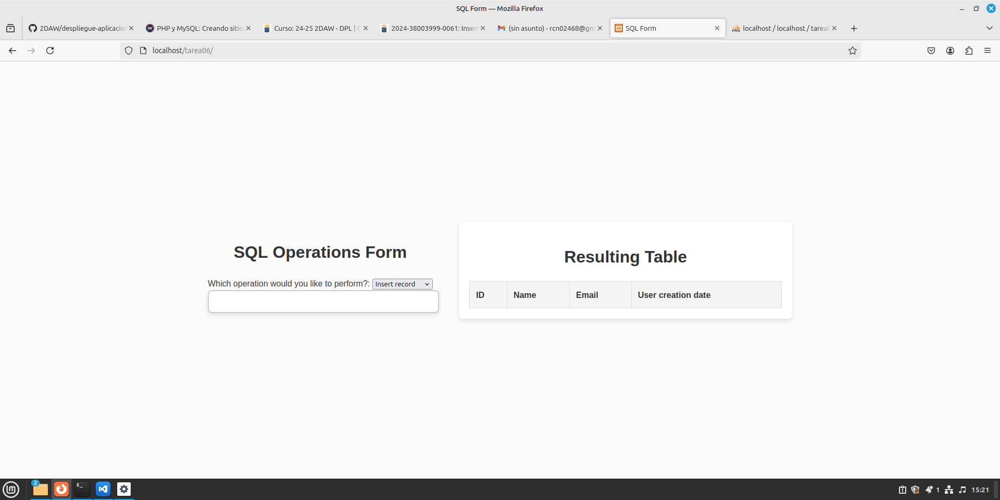
</div>

## Inserción de registros
<div align=center>
    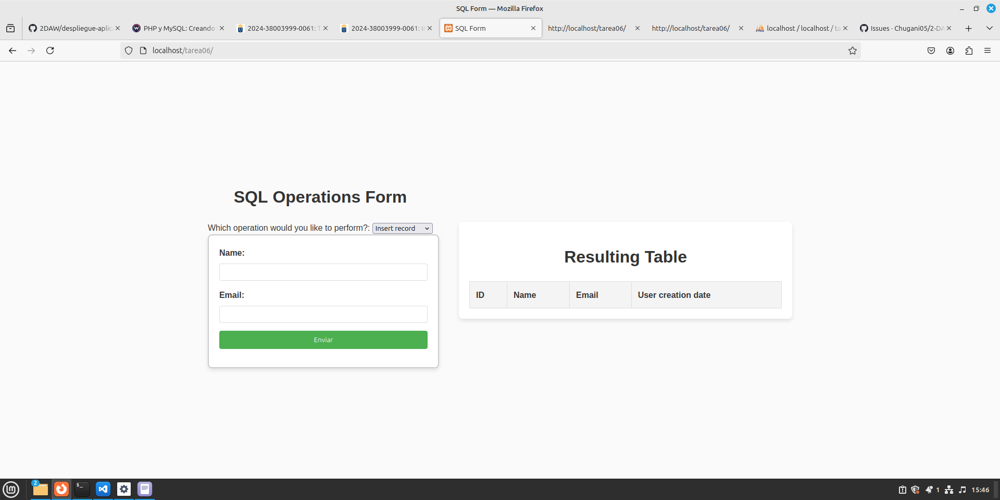
</div>

<div align=center>
    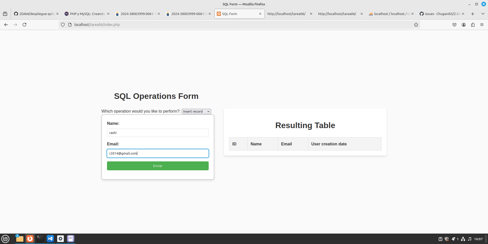
</div>

<div align=center>
    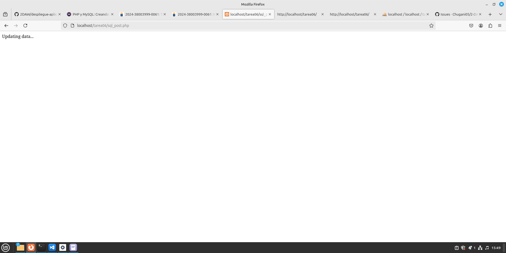
</div>

<div align=center>
    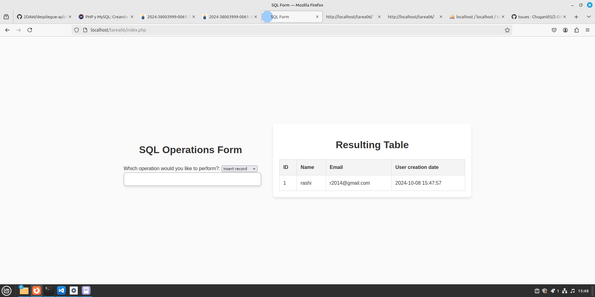
</div>

## Actualización de registros.
<div align=center>
    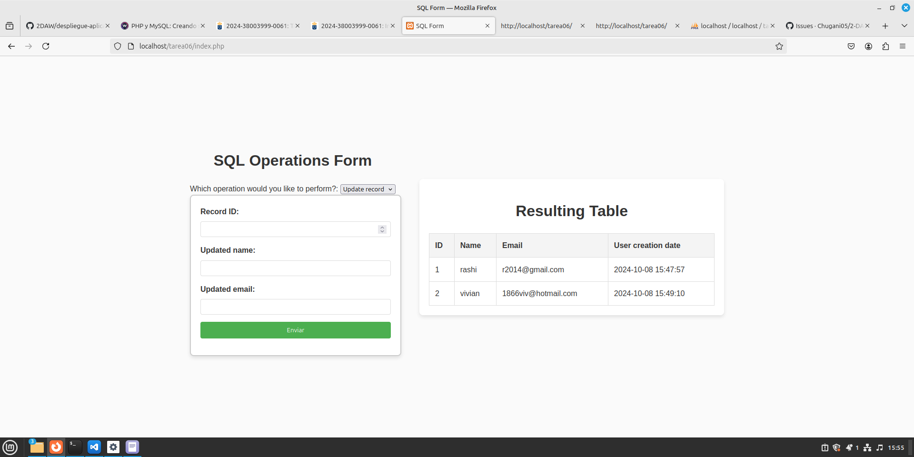
</div>

<div align=center>
    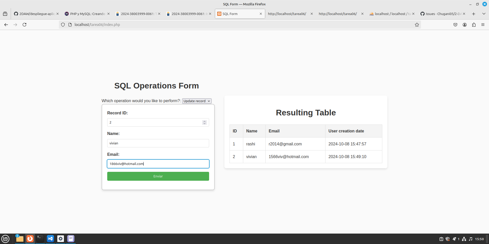
</div>

<div align=center>
    
</div>

<div align=center>
    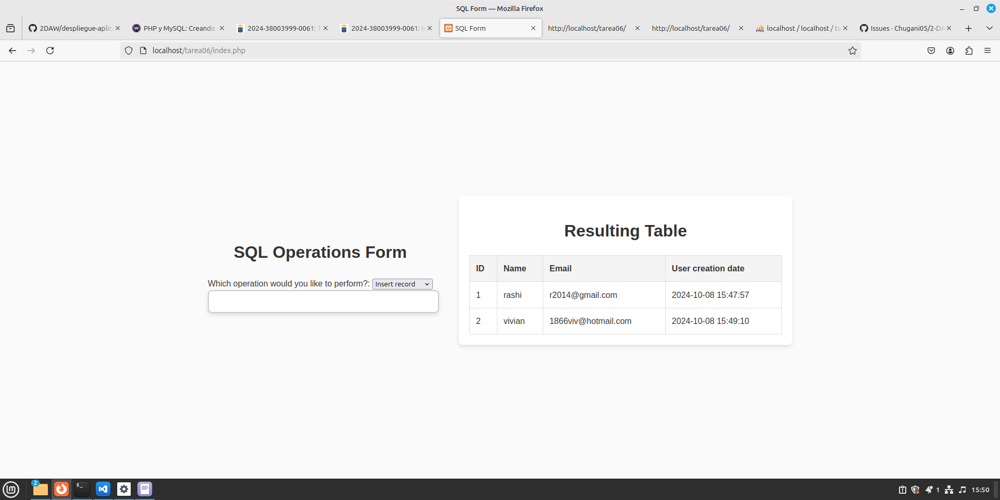
</div>

## Eliminación de registros.
<div align=center>
    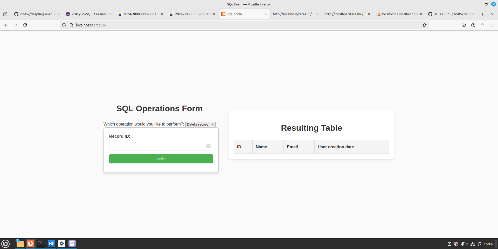
</div>

<div align=center>
    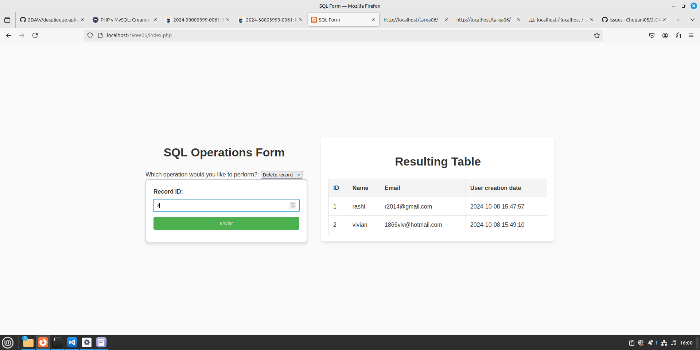
</div>

<div align=center>
    
</div>

<div align=center>
    
</div>
