# Migración de Xampp a InfinityFree

<div align=center>
    
</div>

## Contenido
- [Creación de la cuenta en InfinityFree](#creación-de-la-cuenta-en-infinityfree)
- [Instalación de FileZilla](#instalación-de-filezilla)
- [Vinculación de InfinityFree a Filezilla](#vinculación-de-infinityfree-a-filezilla)
- [MySQL Database en InfinityFree](#mysql-database-en-infinityfree)
- [Adaptación de ficheros](#adaptación-de-ficheros)
- [Migración de ficheros](#migración-de-ficheros)

## Creación de la cuenta en InfinityFree
Al iniciar sesión se nos abre esta pestaña en la que podemos crear cuentas con hacer clic en el botón de `Create Account`.
<div align=center>
    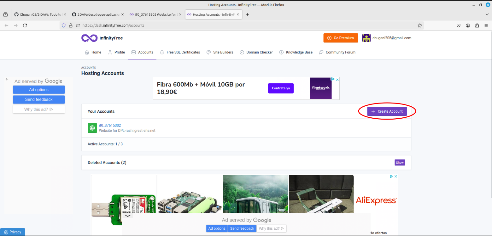
</div>

Al acabar de cear la cuenta se nos abre el panel de control de la cuenta que acabamos de crear.
<div align=center>
    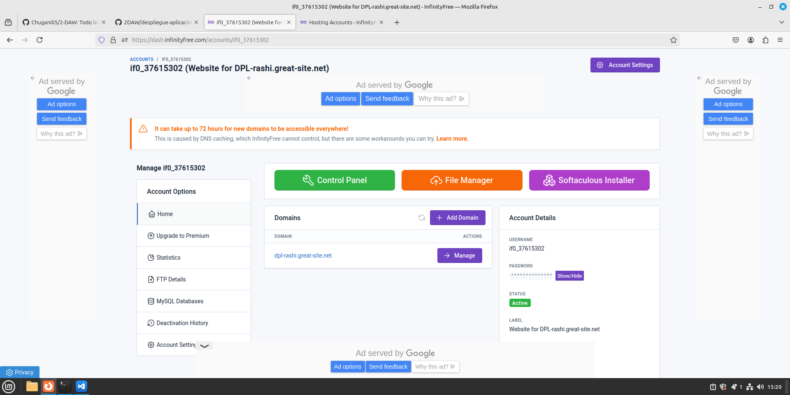
</div>

## Instalación de FileZilla
Instalamos FileZilla mediante el comando:
```
apt install filezilla
```

La ejecutamos con el comando:
```
filezilla
```

Que nos abre la siguiente pestaña.
<div align=center>
    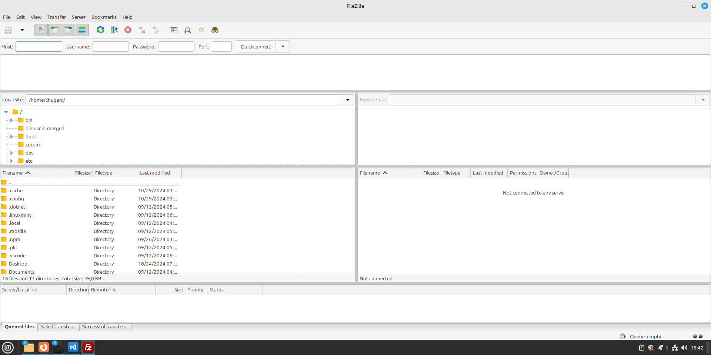
</div>

## Vinculación de InfinityFree a Filezilla
Empezamos la vinculación accediendo a `FTP Details` en `Account Options`.
<div align=center>
    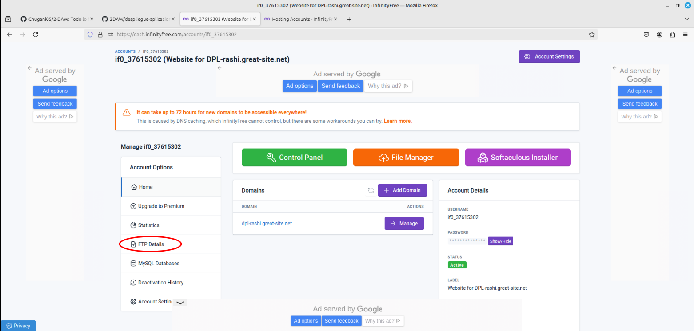
</div>

Esto nos muestra nuestros datos del `FTP Details`.
<div align=center>
    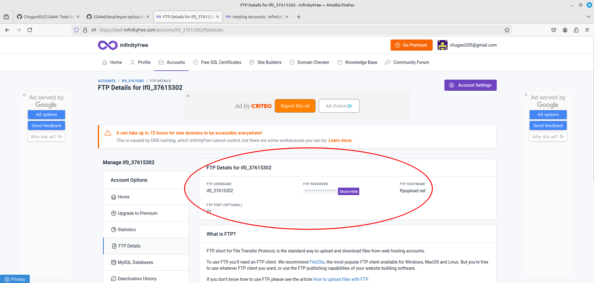
</div>

Seguimos los siguientes pasos para realizar la conexión:
<div align=center>
    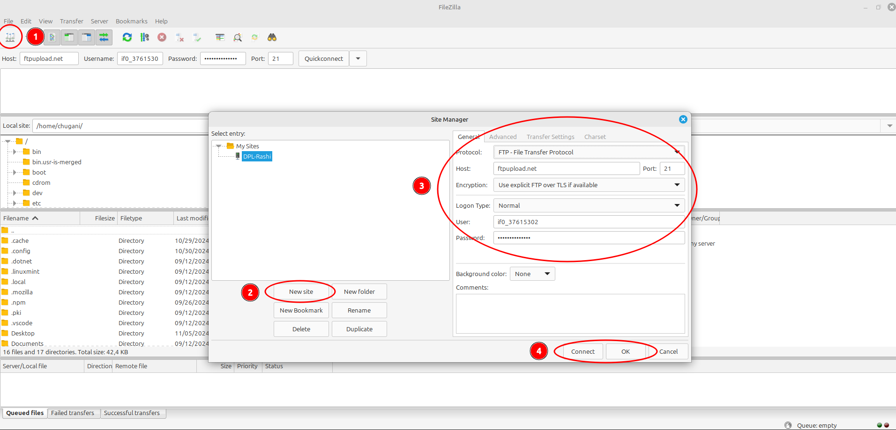
</div>

1. Abrimos el `Site manager`.
2. Creamos un `New site` con un nombre identificativo.
3. Rellenamos con los datos obtenidos de `FTP Details`.
4. Hacemos click en `Connect` si queremos guardar los datos y hacer la conexión, y si solo queremos guardar los datos hacemos click en `Ok`.

Tras realizar la conexión, en el apartado derecho del panel de control se podran ver los ficheros y directorios de InfinityFree del `Website`.
<div align=center>
    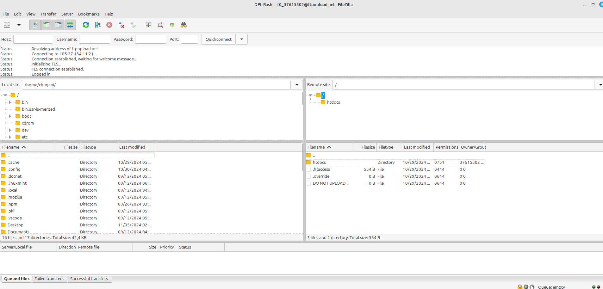
</div>

## MySQL Database en InfinityFree
Empezamos la creación de la base de datos accediendo a `MySQL Databases` en `Account Options`.
<div align=center>
    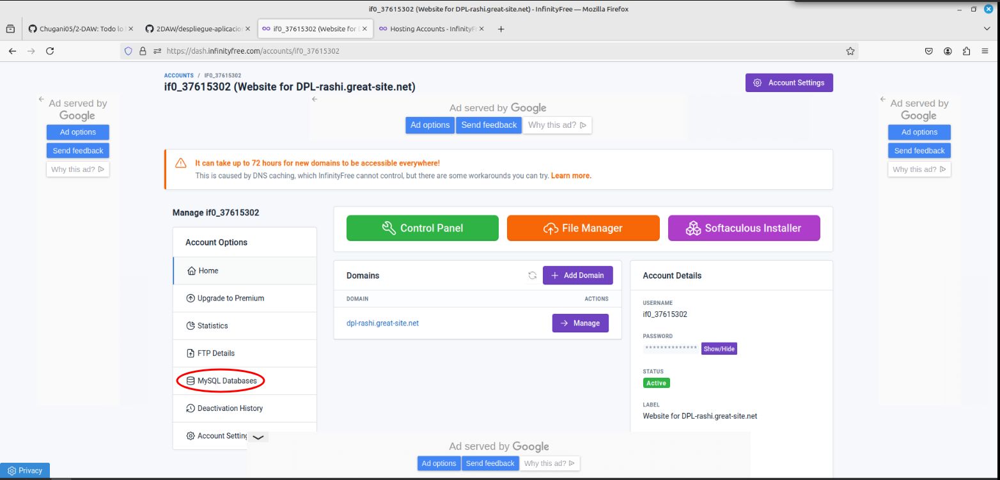
</div>

Esto nos muestra nuestros datos del `MySQL Databases`.
<div align=center>
    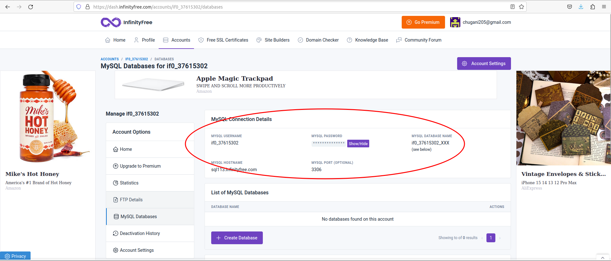
</div>

Empezamos a crear una nueva base de datos haciendo click en el botón de `Create Database`.
<div align=center>
    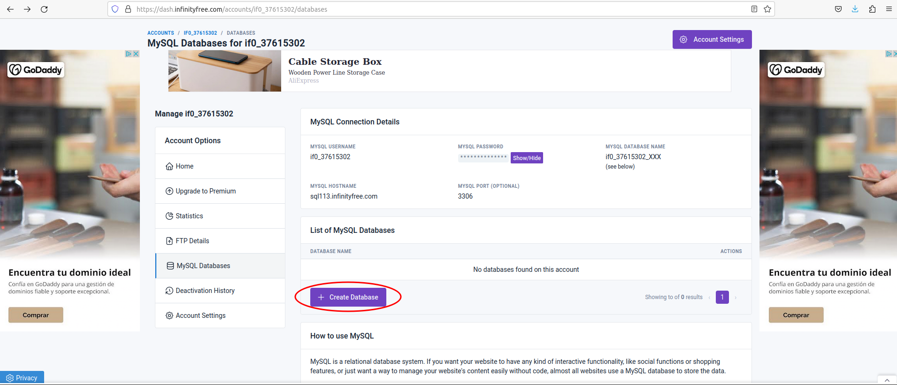
</div>

Que nos lleva a esta página:
<div align=center>
    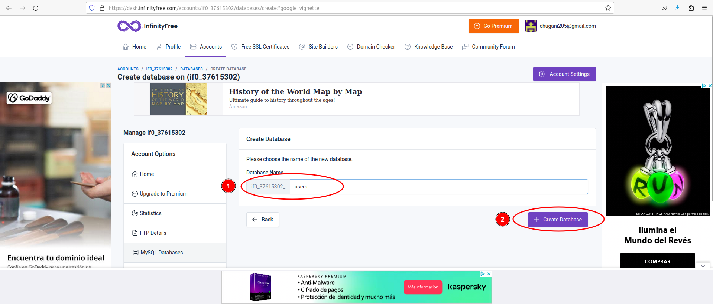
</div>

1. Primero, le ponemos un nombre a la base de datos que queremos crear.
2. Segundo, le damos al botón de `Create Database` para crear la base de datos.

Una vez creada la base de datos accedemos a ella mediante el botón de `phpMyAdmin`.
<div align=center>
    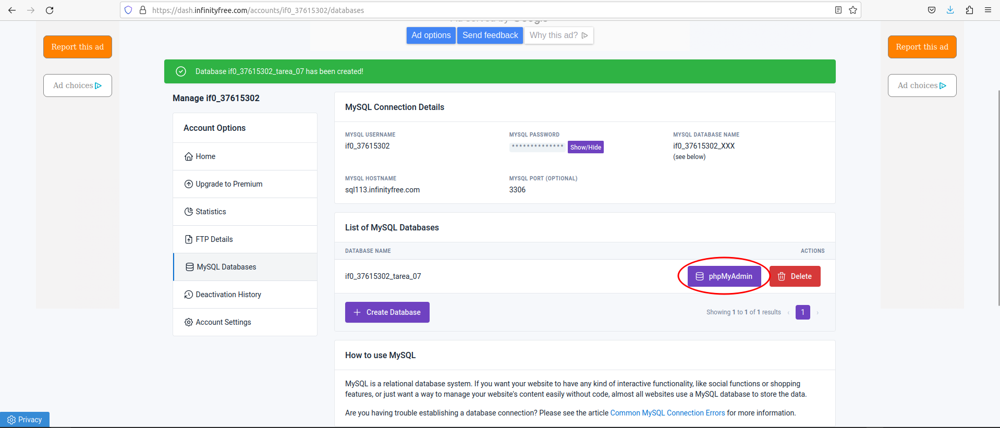
</div>

A continuación se crea la tabla de la misma manera en la que se hizo en la [anterior tarea](../tarea-04/README.md#creación-de-la-tabla), y deberíamos obtener algo asi:
<div align=center>
    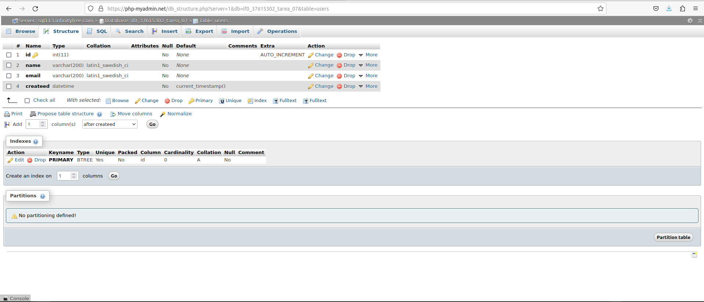
</div>

## Adaptación de ficheros
Debemos cambiar los datos de la [actividad anterior](../tarea-04/README.md#creación-de-la-base-de-datos) para que concuerden con los de esta actividad. Para ello tenemos que cambiar los datos del `mysqli_connect` con los datos del [apartado anterior](#mysql-database-en-infinityfree) de esta manera.

```php
<?php

    $conn = mysqli_connect( 'sql113.infinityfree.com', 'nombreUsuario', 'contraseñaUsuario', 'if0_37615302_tarea_07');

?>
```

## Migración de ficheros
Movemos los ficheros de local a remoto con FileZilla. En la izquierda buscamos nuestros archivos en local, y los soltamos en la derecha para subir a remoto, dentro de la carpeta `htdocs`.

<div align=center>
    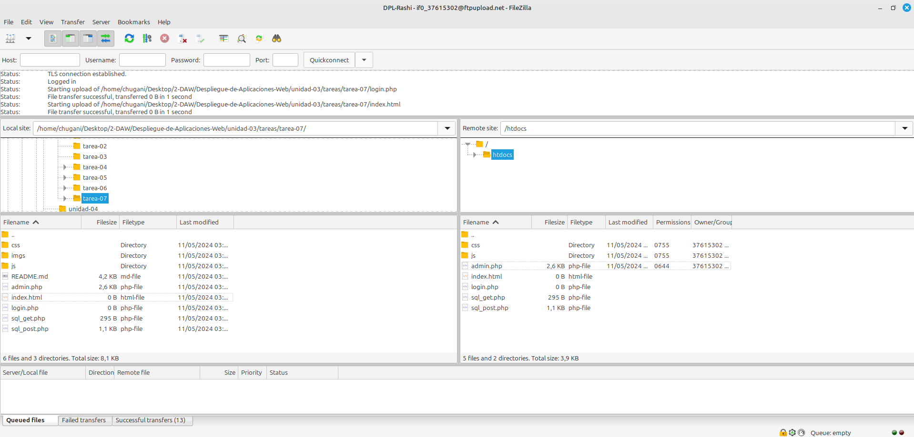
</div>

Ya con todo echo, y sin que nos de error, podemos visualizar los ficheros accediendo directamente desde la URL de pa página web.