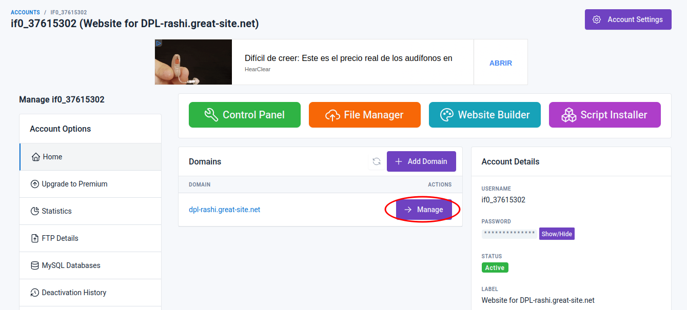
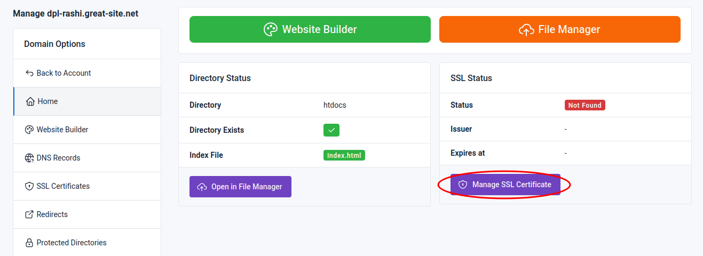
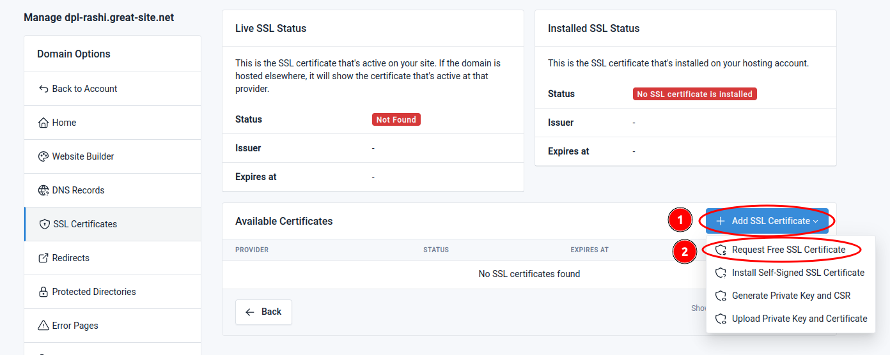
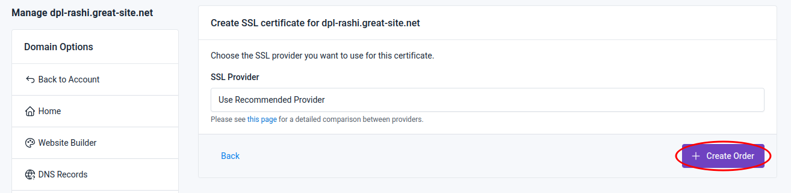
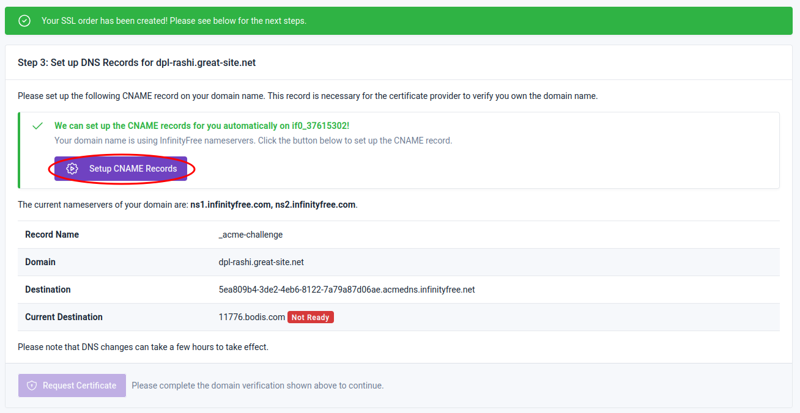
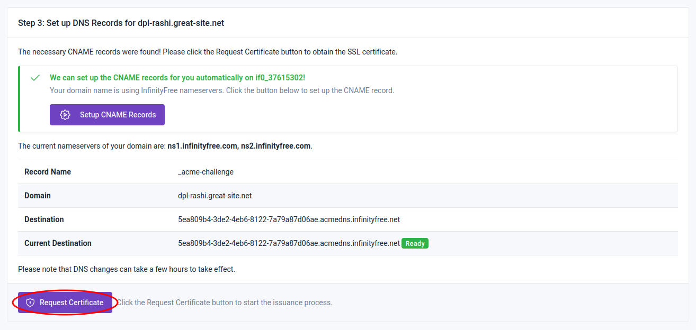
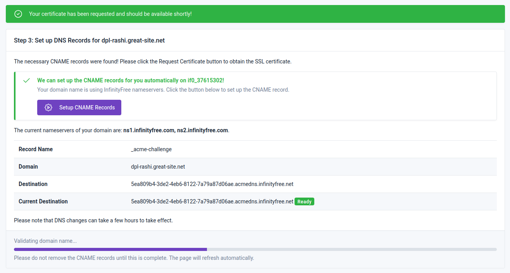
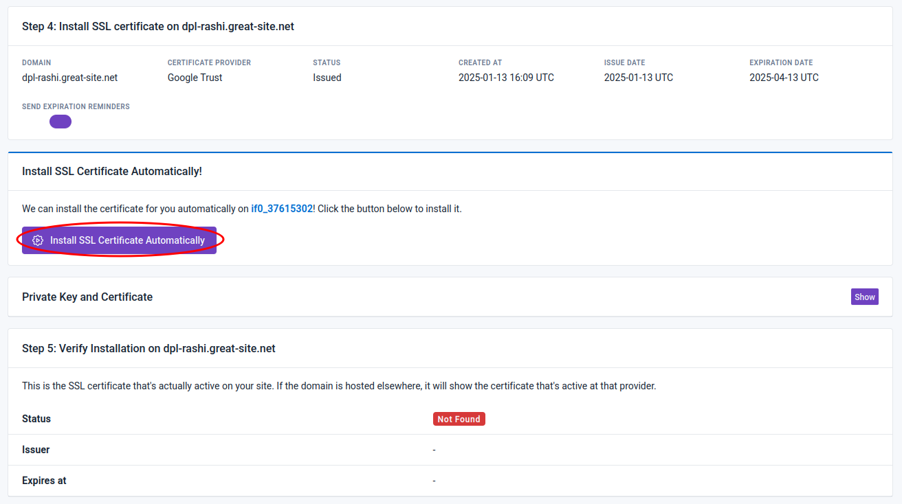
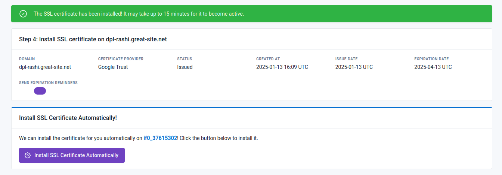
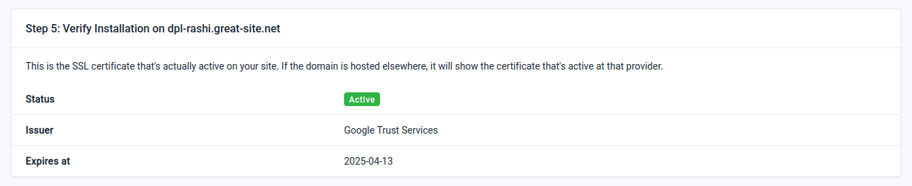

# Instalar certificado SSL en InfinityFree

    

## Contenido
- [Contenido](#contenido)
- [Introducción](#introducción)
- [Instalación del certificado SSL](#instalación-del-certificado-ssl)

## Introducción

La seguridad en línea es un aspecto fundamental para cualquier sitio web, y la implementación de un certificado SSL (Secure Sockets Layer) es una de las medidas más efectivas para proteger la información de los usuarios y garantizar la integridad de los datos transmitidos. Este informe tiene como objetivo proporcionar una guía detallada sobre el proceso de instalación de un certificado SSL en InfinityFree, un servicio de alojamiento web gratuito. A través de los pasos que se describen a continuación, los usuarios podrán asegurar su sitio web y mejorar la confianza de sus visitantes.

## Instalación del certificado SSL

1. Inicie sesión en su cuenta de InfinityFree y acceda al sitio web al que desea añadir el certificado SSL. 
   
2. Una vez en el panel de control del sitio web, haga clic en el botón `Manage`.

    

3. A continuación, se abrirá una ventana donde deberá seleccionar el botón `Manage SSL Certificate`.

    

4. Esto lo llevará a una nueva ventana, donde deberá hacer clic en el botón `Add SSL Certificate`. Se desplegará un menú con las opciones de certificado disponibles. En este caso, seleccione `Request Free SSL Certificate`.

    

5. A continuación, será redirigido a otra página donde la única opción disponible será hacer clic en el botón `Create Order`.

    

6. En este punto, se ha creado el pedido del certificado. El siguiente paso consiste en validar el dominio haciendo clic en el botón `Setup GNAME Records`.

    

7. Después de esperar un momento y recargar la página, se habilitará el botón `Request Certificate`, que anteriormente estaba desactivado. Haga clic en este botón para iniciar el proceso de validación.

    

En este momento, se ha solicitado el certificado, el cual estará disponible en breve.

    

8. Una vez completado el proceso anterior, será redirigido a una página donde deberá instalar el certificado haciendo clic en el botón `Install SSL Certificate Automatically`.

    

La página se recargará automáticamente y se mostrará una ventana que indica que se requieren unos minutos para que el certificado se active.

    

Después de esperar un momento y recargar la página, se mostrará que el certificado está activo.

    

