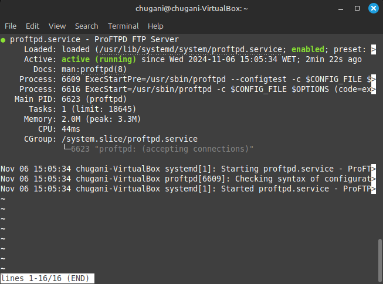
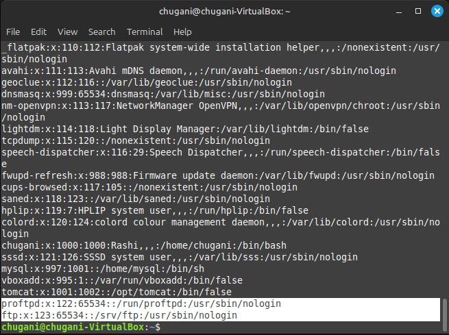
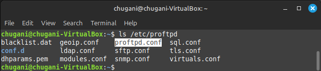
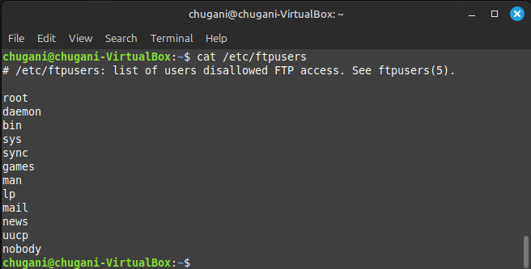
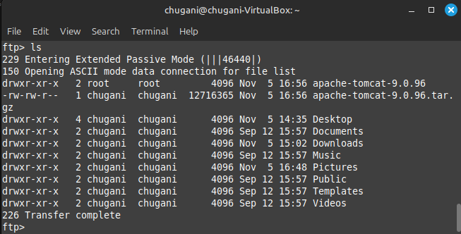
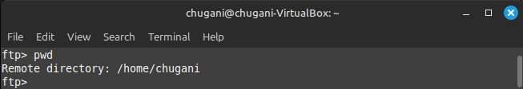
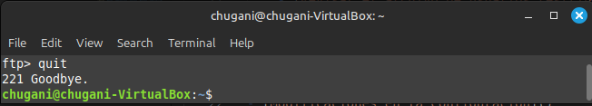
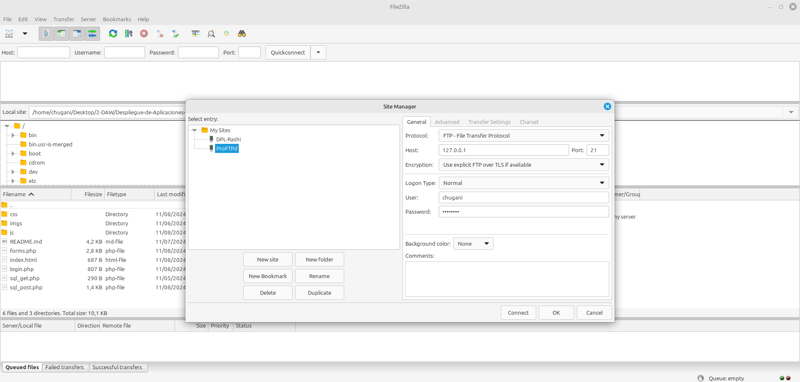
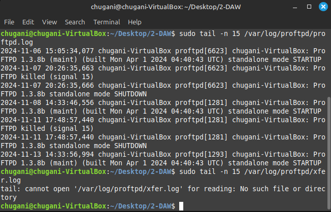

# Instalación de proFTP
<div align=center>
    
</div>

## Contenido
- [Instalación del Servidor FTP](#instalación-del-servidor-ftp)
    - [Actualizar el sistema](#actualizar-el-sistema)
    - [Instalar ProFTPD](#instalar-proftpd)
    - [Verificar el estado del servidor](#verificar-el-estado-del-servidor)
    - [Consultar la versión de ProFTPD](#consultar-la-versión-de-proftpd)
    - [Verificar los usuarios creados durante la instalación](#verificar-los-usuarios-creados-durante-la-instalación)
    - [Listar los archivos de configuración de ProFTPD](#listar-los-archivos-de-configuración-de-proftpd)
    - [Hacer una copia de seguridad del archivo de configuración](#hacer-una-copia-de-seguridad-del-archivo-de-configuración)
- [Configuración del Servidor FTP](#configuración-del-servidor-ftp)
    - [Limpiar el archivo de comentarios y líneas en blanco](#limpiar-el-archivo-de-comentarios-y-líneas-en-blanco)
    - [Revisar el archivo de usuarios restringidos](#revisar-el-archivo-de-usuarios-restringidos)
- [Conexión al Servidor FTP](#conexión-al-servidor-ftp)
    - [Conexión desde la Terminal](#conexión-desde-la-terminal)
        - [Ingresar nombre de usuario y contraseña.](#ingresar-nombre-de-usuario-y-contraseña)
        - [Listar archivos](#listar-archivos)
        - [Consultar directorio actual](#consultar-directorio-actual)
        - [Salir](#salir)
- [Conexión desde el Navegador](#conexión-desde-el-navegador)
- [Conexión desde FileZilla](#conexión-desde-filezilla)
- [Modificaciones en la Configuración](#modificaciones-en-la-configuración)
    - [Modificar proftpd.conf](#modificar-proftpdconf)
    - [Agregar mensajes de bienvenida y error](#agregar-mensajes-de-bienvenida-y-error)
    - [Verificar registros de acceso](#verificar-registros-de-acceso)
    - [Modificar DefaultRoot](#modificar-defaultroot)
    - [Reiniciar el servicio para aplicar cambios](#reiniciar-el-servicio-para-aplicar-cambios)

## Instalación del Servidor FTP
### Actualizar el sistema
```bash
sudo apt-get update
```

### Instalar ProFTPD
```bash
sudo apt-get install proftpd
```

### Verificar el estado del servidor
```bash
service proftpd status
```

<div align=center>
  
</div>

### Consultar la versión de ProFTPD
```bash
proftpd -v

# OUTPUT: ProFTPD Version 1.3.8b
```

### Verificar los usuarios creados durante la instalación
```bash
cat /etc/passwd
```

<div align=center>
  
</div>

### Listar los archivos de configuración de ProFTPD
```bash
ls /etc/proftpd
```

<div align=center>
  
</div>

### Hacer una copia de seguridad del archivo de configuración
```bash
sudo cp /etc/proftpd/proftpd.conf /etc/proftpd/proftpd.conf.copia
```

## Configuración del Servidor FTP
### Limpiar el archivo de comentarios y líneas en blanco
```bash
# accedemos al fichero
sudo vi /etc/proftpd/proftpd.conf

# elimina las líneas que son comentarios
:g/^#/d       

# elimina las líneas vacías
:g/^$/d

# guardar y salir
:wq
```

### Revisar el archivo de usuarios restringidos
```bash
cat /etc/ftpusers
```

<div align=center>
  
</div>

## Conexión al Servidor FTP
### Conexión desde la Terminal
```bash
ftp 127.0.0.1
```

#### Ingresar nombre de usuario y contraseña.
```bash
Name (127.0.0.1:chugani): chugani
Password: ********
```
   
#### Listar archivos
```bash
ftp> ls
```

<div align=center>
  
</div>

#### Consultar directorio actual
```bash
ftp> pwd
```

<div align=center>
  
</div>

#### Salir

```bash
ftp> quit
```

<div align=center>
  
</div>

## Conexión desde el Navegador
En el navegador abrimos el siguente enlace: `ftp://127.0.0.1`.

## Conexión desde FileZilla
Si no tienes instalado FileZilla, puedes ver como se hace la instalación en la [anterior tarea](../../../unidad-03/tareas/tarea-07/README.md#instalación-de-filezilla). 

### Configuración en FileZilla
Hacemos la configuración de la conexión tal y como hicimos en la [tarea anterior](../../../unidad-03/tareas/tarea-07/README.md#vinculación-de-infinityfree-a-filezilla).

<div align=center>
  
</div>

## Modificaciones en la Configuración
### Modificar proftpd.conf
Abrimos el fichero con el siguiente comando:

```bash
sudo nano /etc/proftpd/proftpd.conf
```

Cambiamos lo necesario en la configuración:

```txt
ServerName "My server FTP"
DeferWelcome off
TimeoutIdle 1200
Port 21
maxInstances 30
ShowSymlinks on
User proftpd
Group nogroup
Umask 022 022
TransferLog /var/log/proftpd/xferlog
SystemLog /var/log/proftpd/proftpd.log
```

### Agregar mensajes de bienvenida y error
```txt
AccessGrantMSG "Bienvenido al servidor FTP de Rashi Chugani"
AccessDenyMSG "Error de entrada a mi servidor FTP"
```

### Verificar registros de acceso
```bash

# Muestra las últimas 15 líneas del log general de ProFTPD, con eventos del servidor
sudo tail -n 15 /var/log/proftpd/proftpd.log

# Muestra las últimas 15 líneas del log de transferencias de archivos en ProFTPD
sudo tail -n 15 /var/log/proftpd/xfer.log
```

<div align=center>
  
</div>

### Modificar DefaultRoot
```bash
DefaultRoot ~
```

### Reiniciar el servicio para aplicar cambios
```bash
service proftpd reload
```
