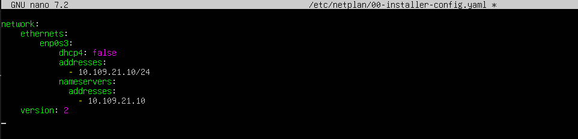

# Instalación de vsFTP en Ubuntu server

<div align=center>
    
</div>

## Contenido
- [Contenido](#contenido)
- [Instalación de vsFTPd](#instalación-de-vsftpd)
- [Comandos utiles](#comandos-utiles)
- [Configuración del servidor](#configuración-del-servidor)
  - [Empezamos creando un fichero `netplan`, acedemos a este mediante el siguiente comando:](#empezamos-creando-un-fichero-netplan-acedemos-a-este-mediante-el-siguiente-comando)
  - [Accedemos al fichero de configuración `vsftpd` mediente el sigueinte comando:](#accedemos-al-fichero-de-configuración-vsftpd-mediente-el-sigueinte-comando)
- [Creación de usuarios locales enjaulados en su directorio, exepto el `administrador`](#creación-de-usuarios-locales-enjaulados-en-su-directorio-exepto-el-administrador)
  - [Añadiendo los usuarios](#añadiendo-los-usuarios)
  - [Configuración de los usuarios](#configuración-de-los-usuarios)
- [Creación de usuarios locales que no pueden conectarse al servidor FTP](#creación-de-usuarios-locales-que-no-pueden-conectarse-al-servidor-ftp)
  - [Añadiendo los usuarios](#añadiendo-los-usuarios-1)
  - [Configuración de los usuarios](#configuración-de-los-usuarios-1)
- [Personalización de mensaje de bienvenida](#personalización-de-mensaje-de-bienvenida)
- [Activavión de `Logs`](#activavión-de-logs)
- [Desconexión automatica tras 5 minutos de inactividad](#desconexión-automatica-tras-5-minutos-de-inactividad)
- [Cifrado de las conexiones SSL](#cifrado-de-las-conexiones-ssl)


## Instalación de vsFTPd

1. En la maquina servidor instalamos vsFTP mediente el siguiente comando:

    ```sh
    sudo apt install vsftpd
    ```

2. También podemos instalar `net-tools`, que nos permite lanzar `ifconfig`, este nos devuelve la información de nuestra red.
    ```sh
    sudo apt-get install net-tools
    ```


## Comandos utiles

- Ver estado:
    ```sh
    sudo service vsftpd status
    ```

- Apagar:
    ```sh
    sudo service vsftpd stop
    ```

- Arrancar:
    ```sh
    sudo service vsftpd start
    ```

- Reiniciar:
    ```sh
    sudo service vsftpd restart
    ```


## Configuración del servidor
### Empezamos creando un fichero `netplan`, acedemos a este mediante el siguiente comando:

```sh
sudo nano /etc/netplan/00-installer-config.yaml
```

1. Y lo cambiamos para que se vea igual que en la siguiente imagen:

<div align=center>
    
</div>

> [!NOTE]
> Cuidado con los espacios!! Si la alineación no está bien, no funcionara.

2. Para aplicar los cambios realizados, ejecutamos el siguiente comando:

    ```sh
    sudo netplan apply
    ```

### Accedemos al fichero de configuración `vsftpd` mediente el sigueinte comando:

```sh
sudo nano /etc/vsftpd.conf
```

1. Y cambiamos las siguientes configuraciones:

    ```sh
    # Cambiamos. El usuario anonymous puede conectarse y descargar ficheros, estará enjaulado.
    anonymous_enable=YES

    # Añadimos. Un directorio a los usuarios anonymous, al conectarse se les redirigira automaticamente a ese directorio..
    anon_root=/srv/ftp/anonimo

    # Descomentamos. Los usuarios locales pueden conectar y subir/descargar ficheros. 
    write_enable=YES
    local_unmask=022
    ```

> [!IMPORTANT]
> Tras hacer una modificación en cualquier archivo, hay que hacer un restart como ya indicamos [anteriormente](#comandos-utiles).


## Creación de usuarios locales enjaulados en su directorio, exepto el `administrador`
### Añadiendo los usuarios

1. Vamos a crear 2 usuarios con su directorio personal con el siguente comando:
    ```sh
    # Creamos un usuario llamado `Alex`
    sudo adduser alex

    # Creamos un usuario llamado `Dom`
    sudo adduser dom
    ```

2. Comprobamos que se hayan creado mediante:

    ```sh
    cat /etc/passwd
    ```

### Configuración de los usuarios
1.  Volvemos a acceder al fichero de configuración `vsftpd` como en el [apartado anterior](#accedemos-al-fichero-de-configuración-vsftpd-mediente-el-sigueinte-comando).

2. Descomentamos en el fichero los siguentes comandos:

    ```sh
    # Enjaula los usuarios locales.
    chroot_local_user=YES

    # Activamos la lista donde meteremos los usuarios que no estarán enjaulados.
    chroot_list_enable=YES

    # La lista, que se encuenta en esta ubicación.
    chroot_list_file=/etc/vsftpd.chroot_list
    ```

3. Añadimos el siguente commando:

    ```sh
    # Para que los usuarios enjaulados puedan crear ficheros en su directorio personal.
    allow_writeable_chroot=YES
    ```

4. Creamos el archivo `vsftpd.chroot_list`, que engloba a los usuarios que se pueden mover libremente. El resto estarán enjaulados:

    ```sh
    sudo nano /etc/vsftpd.chroot_list
    ```

5. Añadimos a los usuarios a esta lista:

    ```sh
    administrador
    ```


## Creación de usuarios locales que no pueden conectarse al servidor FTP
### Añadiendo los usuarios

1. Vamos a crear 2 usuarios más (uno llamdo `Ethan` y otro `Arturo`) con su directorio personal con en el [anterior apartado](#añadiendo-los-usuarios).

2. Tras esto comprobamos que se hayan creado con en el [anterior apartado](#añadiendo-los-usuarios).

### Configuración de los usuarios

1.  Volvemos a acceder al fichero de configuración `vsftpd` como en el [apartado anterior](#accedemos-al-fichero-de-configuración-vsftpd-mediente-el-sigueinte-comando).

2.  Añadimos los siguentes commandos:

    ```sh
    # Activación de lista donde estarán los usuarios bloqueados.
    userlist_enable=YES

    # Activamos también la lista de denegación.
    userlist_ddeny=YES

    # Creamos la lista con su ubicación.
    userlist_file=/etc/vsftpd.user_list
    ```

3. Creamos el archivo `vsftpd.user_list`, que engloba a los usuarios que se les deniega el acceso:

    ```sh
    sudo nano /etc/vsftpd.user_list
    ```

4. Añadimos a los usuarios a esta lista:

    ```sh
    ethan
    arturo
    ```


## Personalización de mensaje de bienvenida

1. Volvemos a acceder al fichero de configuración `vsftpd` como en el [apartado anterior](#accedemos-al-fichero-de-configuración-vsftpd-mediente-el-sigueinte-comando).

2. Descomentamos en el fichero el siguente comando:

    ```sh
    ftpd_banner=Bienbenidos al servidor de rc
    ```


## Activavión de `Logs`

1. Accedemos de nuevo al fichero de configuración `vsftpd` como en el [apartado anterior](#accedemos-al-fichero-de-configuración-vsftpd-mediente-el-sigueinte-comando).

2. Comprobamos que el siguente comando este descomentado:

    ```sh
    ftpd_banner=Bienbenidos al servidor de rc
    ```

3. Descomentamos en el fichero el siguente comando:

    ```sh
    # Los logs se guardan en este archivo de forma automatica.
    xferlog_file=/var/log/vsftpd.log
    ```


## Desconexión automatica tras 5 minutos de inactividad

1.  Volvemos a acceder al fichero de configuración `vsftpd` como en el [apartado anterior](#accedemos-al-fichero-de-configuración-vsftpd-mediente-el-sigueinte-comando).

2.  Añadimos los siguentes commandos:

    ```sh
    idle_session_timeout=300
    ```


## Cifrado de las conexiones SSL

1. Generamos un certificado autofirmado, con el que cifraremos las conexiones, mediente el siguiente comando:

    ```sh
    openssl req -x509 -nodes -newkey rsa:2048 -keyout /etc/ssl/private/vsftpd.pem -out /etc/ssl/certs/vsftpd.pem -days 365
    ```

2. Accedemos de nuevo al fichero de configuración `vsftpd` como en el [apartado anterior](#accedemos-al-fichero-de-configuración-vsftpd-mediente-el-sigueinte-comando).

3. Cambiamos los comandos en el fichero para que nos queden de la sigiente forma:

    ```sh
    rsa_cert_file=/etc/ssl/certs/vsftpd.pem
    rsa_private_key_file=/etc/ssl/private/vsftpd.pem
    ssl_enable=YES
    ```