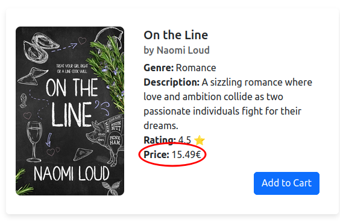
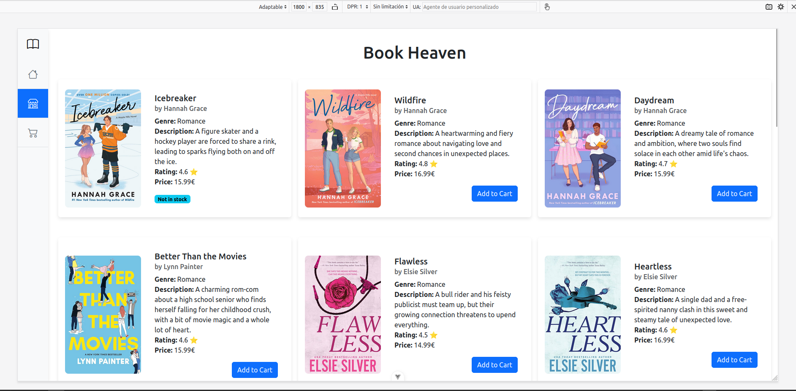

# Actividad 1: Checklist de Usabilidad Web

1. **Is your text annoying?**

    No, la información importante esta en negrita para que capte la atención y las descripciones en texto normal.

    

2. **Do you offer prices?**

    Sí, teneindo en cuenta quie mi aplicación es una tienda de libros hace falta dar el precio para que los compradores sepan cuanto cuesta el libro.

    

3. **Does your content require horizontal scrolling?**

    No, esta hecha de tal forma que no haya un escroll horizontal, pero si uno vertical.

    

4. **Have you added descriptions to images?**

    Sí, todas las imagenes tienen un `ALT` con el nombre del libro, por ejemplo: `Daydream cover`.

    

5. **Is your name and logo on every page?**

    No, el nombre de la web solo esta en el `home` y en el `shop`, y no hay un logo como tal para la web.

    **Mejora:** Tengo que crea un logo para la web y hacer un encabezado con el logo y el nombre de la web que esté en todas la páginas.

    

6. **Is your site accessible for users with disabilities?**

7. **Does your site render correctly in different screen resolutions?**
    
    Sí, hay 3 resoluciones distintas que cambian dependiendo de tamaño de la pantalla.

    

    

    

8. Do you offer a search function?
9.  Is your navigation clear and simple?
10. Do you have “white space”?
11. Do you have a site map?
12. Does your logo link home?
13. Does your design guide the eye?
14. Have you offered contact information?
15. Does your information look like an ad?
16. Have you used color properly?
17. Is your site organized with a consistent structure?
18. Do you show users where they’ve been?
19. Do you link within a page?