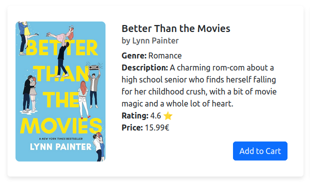
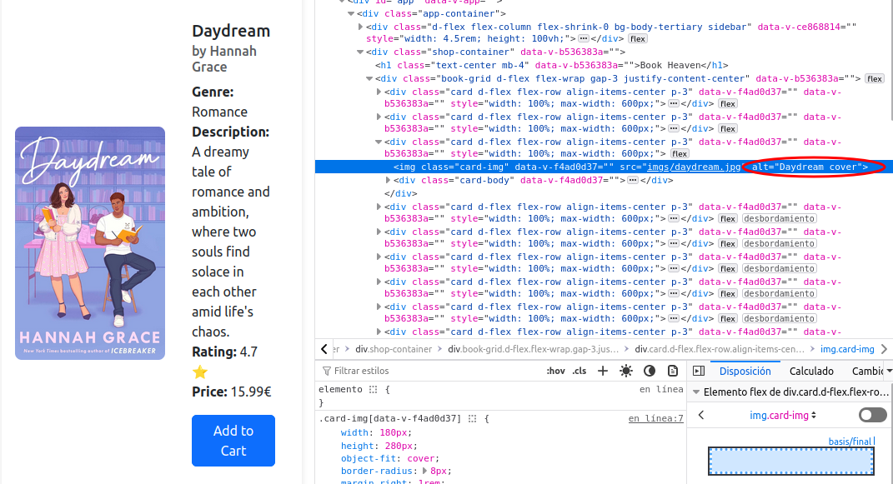
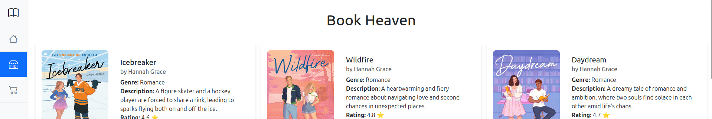
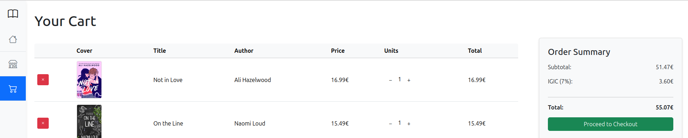
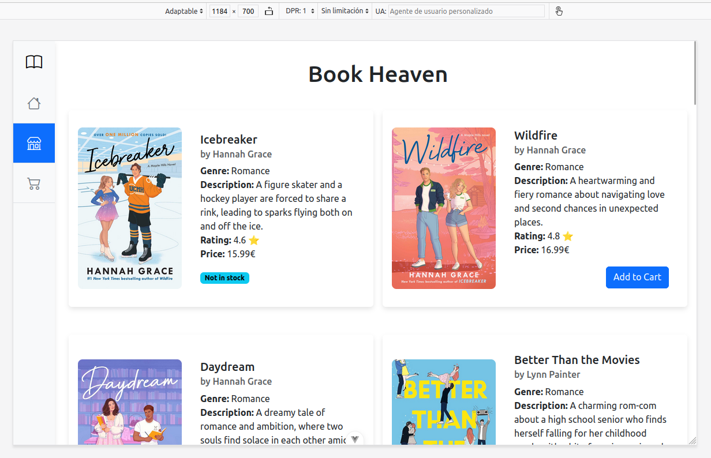
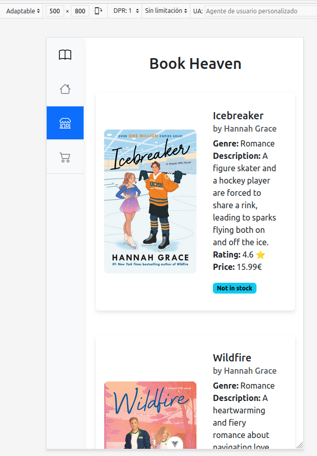
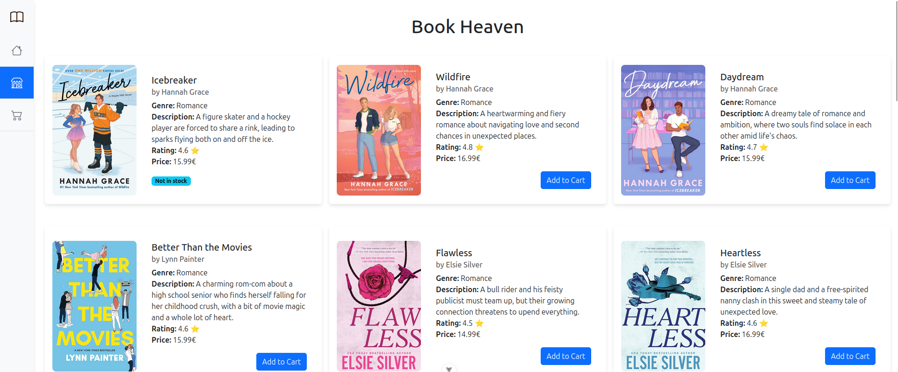
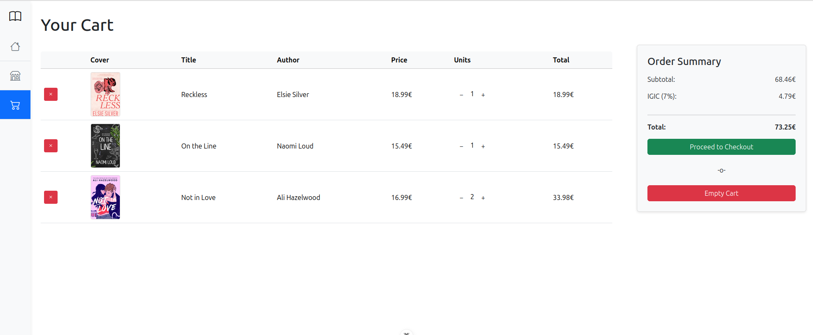
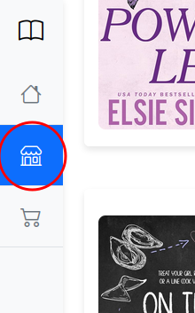

# Actividad 1: Checklist de Usabilidad Web

## Checklist

❌  1. ¿Tu texto resulta molesto?

✅  2. ¿Ofreces precios?

❌  3. ¿Tu contenido requiere desplazamiento horizontal?

✅  4. ¿Has añadido descripciones a las imágenes?

## Respuestas

1. **¿Tu texto resulta molesto?**

    No, el texto está diseñado para ser claro y fácil de leer. La información más relevante está destacada en negrita, lo que permite que los usuarios la identifiquen rápidamente, mientras que las descripciones están en texto normal para una lectura más detallada.

    

2. **¿Ofreces precios?**

    Sí, dado que mi aplicación es una tienda en línea de libros, los precios están claramente visibles para que los compradores puedan conocer el costo de cada libro antes de realizar una compra.

    

3. **¿Tu contenido requiere desplazamiento horizontal?**

    No, la estructura de la página está diseñada para evitar el desplazamiento horizontal. Sin embargo, se permite el desplazamiento vertical para una mejor navegación.

    

4. **¿Has añadido descripciones a las imágenes?**

    Sí, todas las imágenes cuentan con un atributo `alt` que describe el contenido visual de manera adecuada. Por ejemplo, en las portadas de los libros se utiliza una descripción como `Daydream cover`, lo que mejora la accesibilidad.

    

5. **¿Tu nombre y logo están en cada página?**

    No, actualmente el nombre de la web solo aparece en la página de inicio (`home`) y en la tienda (`shop`). Además, no se ha definido un logo específico aún.

    **Mejora:** Es necesario crear un logo para la web y colocar un encabezado con el logo y el nombre de la web en todas las páginas para una experiencia de navegación más coherente.

    

    

6. **¿Tu sitio es accesible para usuarios con discapacidades?**

    Parcialmente. Se han añadido descripciones (`alt`) en las imágenes, lo cual es un buen paso hacia la accesibilidad. Sin embargo, faltan funciones como navegación mediante teclado y compatibilidad con lectores de pantalla.

    **Mejora:** Implementar etiquetas `aria`, mejorar el contraste de colores y permitir navegación sin necesidad del ratón.

    

7. **¿Tu sitio se ve correctamente en diferentes resoluciones de pantalla?**
    
    Sí, el diseño de la página está adaptado para mostrarse correctamente en tres resoluciones distintas, lo que asegura una experiencia de usuario óptima en dispositivos de diferentes tamaños.

    

    

    

8. **¿Ofreces una función de búsqueda?**

    No, actualmente no existe una función de búsqueda para que los usuarios puedan buscar libros por nombre o autor, lo cual limita un poco la navegación.

    **Mejora:** Implementar una barra de búsqueda en la parte superior de la página, lo que permitirá a los usuarios encontrar libros o autores de manera más rápida y eficiente.

    

9. **¿Tu navegación es clara y sencilla?**

    Sí, la web cuenta con una barra de navegación que incluye todas las páginas disponibles.

    

10. **¿Tienes espacio en blanco ("white space")?**

    Sí, se utiliza espacio en blanco de manera adecuada. Esto mejora tanto la legibilidad como la estética del diseño.

    

11. **¿Tienes un mapa del sitio?**

    No, actualmente no cuenta con un mapa del sitio, ya que todas las páginas de la web son independientes entre sí. La navegación se organiza de manera que no se requiere una estructura centralizada.

    

12. **¿Tu logo enlaza a la página de inicio?**

    Sí, aunque aún no tengo un logo definitivo, el logo temporal que se encuentra en la página tiene la funcionalidad de redirigir a los usuarios a la página de inicio al hacer clic sobre él.

    

13. **¿Tu diseño guía la vista del usuario?**

    Sí, el diseño no es plano; se utilizan negritas para resaltar información importante. La paleta de colores, que incluye azul, azul claro, negro, gris y blanco, crea contraste y claridad. Además, las imágenes de las portadas de los libros aportan toques de color y evitan que el diseño se vuelva monótono.

    

14. **¿Has ofrecido información de contacto?**

    No, actualmente no existe una sección en la que los usuarios puedan encontrar nuestra información de contacto.

    **Mejora:** Sería útil agregar una sección de "Contacto" en la barra de navegación, donde los usuarios puedan acceder a nuestra información de contacto, incluyendo el correo electrónico, número de teléfono y la dirección de nuestra tienda física, junto con un mapa para su fácil localización.

    

15. **¿Tu información parece un anuncio?**

    No, la información presentada en el sitio está enfocada en la venta de libros y en la experiencia de compra, por lo que no tiene la apariencia de un anuncio intrusivo.

    

    

16. **¿Has utilizado los colores de manera adecuada?**

    Sí, se ha seleccionado una paleta de colores compuesta por azul, negro, blanco y gris, que mantiene el diseño limpio y profesional. Las negritas resaltan información importante sin saturar visualmente al usuario.

17. **¿Tu sitio está organizado con una estructura consistente?**

    Sí, todas las páginas comparten una estructura coherente con una barra de navegación fija y el contenido principal bien definido. Esto facilita la navegación del usuario.

18. **¿Le muestras a los usuarios dónde están?**

    Sí, la barra de navegación indica la página en la que el usuario se encuentra actualmente, lo que les permite saber en todo momento su ubicación dentro de la aplicación.

    

19. **¿Tienes enlaces dentro de una misma página?**

    No, actualmente todos los enlaces redirigen a páginas distintas dentro de la aplicación.

    **Mejora:** Considerar añadir anclas internas para secciones extensas de contenido si en el futuro se expande la información.

20. **¿Tu redacción es clara y directa?**

    Sí, el contenido se presenta de manera sencilla, enfocada en brindar la información necesaria sobre los libros y facilitar la experiencia de compra.

    

21. **¿Respondes a las preguntas de tus usuarios?**

    No, actualmente no existe un apartado donde los usuarios puedan dejar sus dudas o preguntas.

    **Mejora:** Sería útil implementar una sección de preguntas frecuentes (FAQ) o un formulario de contacto para que los usuarios puedan enviar sus dudas y recibir respuestas de manera más eficiente.

    

22. **¿Tu redacción sigue el formato de pirámide invertida?**

    No, la información está dispuesta de manera aleatoria, sin priorizar lo más importante.

    **Mejora:** Se recomienda reorganizar la información de los libros, destacando lo más relevante al inicio y siguiendo el formato de pirámide invertida para facilitar la comprensión rápida.

    

23. **¿Tu sitio requiere plugins innecesarios?**

    No, la web no requiere ningún plugin adicional para funcionar correctamente.

24. **¿Has habilitado la degradación elegante?**

    No específicamente, pero el sitio está diseñado de manera simple, lo que garantiza que funcione incluso si algunos estilos o scripts no cargan.

    **Mejora:** Implementar estrategias para asegurar una experiencia aceptable si TypeScript está deshabilitado.

    

25. **¿Proporcionas pistas visuales para los enlaces?**

    Sí, los enlaces en la barra de navegación tienen iconos que indican claramente a dónde redirigen. Además, para aquellos que puedan no entenderlos, tienen un mensaje emergente (tooltip) que muestra el nombre del sitio al que lleva el enlace.

    

26. **¿Tus gráficos tienen algún significado?**

    Sí, las imágenes que se utilizan en la web son principalmente las portadas de los libros que están a la venta. Estas imágenes ayudan a identificar los productos y proporcionan un toque visual atractivo.

    

27. **¿Tu sitio está lleno de animaciones?**

    No, el sitio mantiene un diseño sobrio sin animaciones excesivas que puedan distraer a los usuarios.

    

28. **¿Tienes un eslogan?**

    Sí, en la página de inicio hay una frase breve que comunica claramente que la web está dedicada a la venta de libros.

    

29. **¿Tus enlaces funcionan?**

    Sí, todos los enlaces han sido probados y llevan a las páginas correspondientes dentro de la web.

    

30. **¿Has probado en navegadores alternativos?**

    No, actualmente solo se ha probado en un navegador principal.

    **Mejora:** Realizar pruebas en navegadores alternativos como Google, Safari y Microsoft Edge para garantizar compatibilidad.

    

