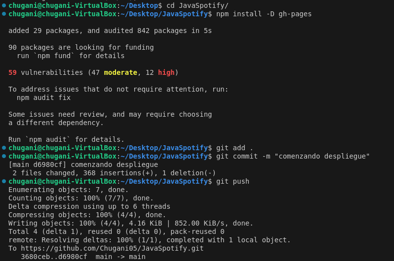
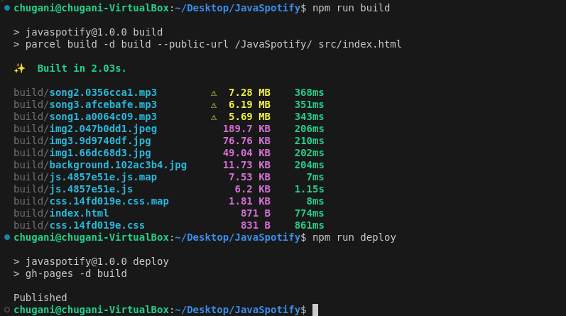

# Deployment Web in Github Pages with NPM and Parcel.

### Nos situamos en el `package.json` de nuestro proyecto y añadimos las lineas resaltadas en la siguiente imagen en el apartado `scripts`. Teniendo en cuenta que en la linea de `start` donde pone `src/index.html` colocamos la ruta al html y en la linea `build` donde pone `JavaSpotify` va el nombre de nuestro repositorio de github.

    

### Antes de empezar a contruir nada, añadimos al archivo `.gitignore` los sigientes archivos: `node_modules/`, `.cache`, `dist/` y `build/`.

### A continuación nos situamos en la carpeta de nuestro repositorio e instalamos gh-pages con el comando `npm install -D gh-pages`. Después de eso añadimos los cambios realizados al github.

    

### Ya por último, ejecutamos los commandos `npm run build` y `npm run deploy` que nos crea la rama gh-pages y la página del proyecto.

    

